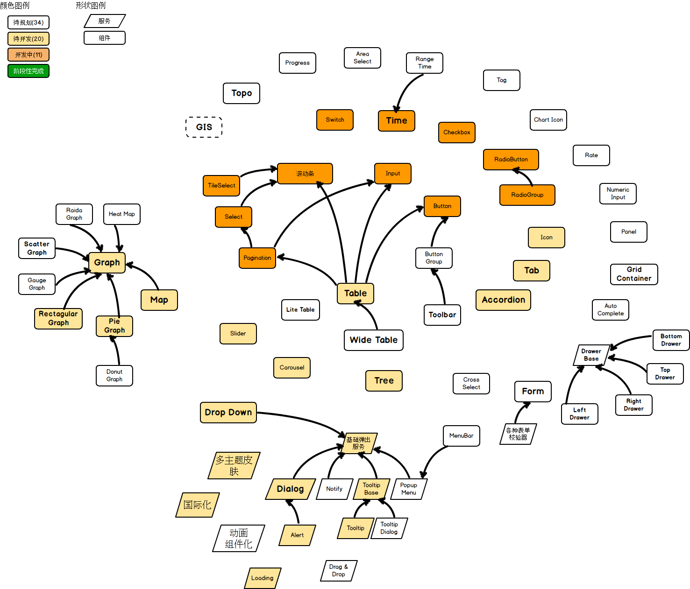

# Jigsaw-七巧板

[](https://badge.fury.io/js/%40rdkmaster%2Fjigsaw)
[](https://travis-ci.org/rdkmaster/jigsaw)
[](https://coveralls.io/github/rdkmaster/jigsaw?branch=master)
[](http://rdkmaster.com/e2e-testcase-count)


## 名字的内涵
Jigsaw原意是七巧板，一种拼图游戏。游戏的过程和现代web页面开发过程很类似，游戏者按照既定的蓝图将杂乱的碎片组合成一幅图，我们使用这个名字正是为了让web页面开发者能够像玩Jigsaw游戏一样，边玩边开发你的页面。

**组合**是Jigsaw的灵魂，我们致力于将组合做到极致。

把若干组件按照一定的顺序排列&布局之后可以得到一个应用页面，这是通常意义上的组合，我们将这个层次的组合称归之为Level I。Level I 的组合把组件当做原子，不可再拆分。

Jigsaw的组件不再是原子，它对组件的功能进行了二次抽象，同时，允许组件的局部高度定制化，甚至有的组件做到完全的可定制化。小到类似`jigsaw-button`这样的基础组件，大到`jigsaw-table`这样的巨无霸组件，你看到的几乎每个UI元素，都是可以与其他组件再组合来覆盖其默认行为。原子组件是有限的，组合才能产生无限的可能。这里提到的定制化，换句话说，就是另一种形式的组合，我们将这个层次的组合归为Level II。

用Jigsaw，尽情释放你的想象力吧！


## 用法
### 全新的开始
我们强烈推荐使用 [Jigsaw Seed](https://github.com/rdkmaster/jigsaw-seed) 来作为新工程的开始。具体步骤为：
1. 如果未安装nodejs，或者nodejs低于6.x.x，npm版本低于3.x.x，请先安装[nodejs](https://nodejs.org)。
2. [下载](https://github.com/rdkmaster/jigsaw-seed/archive/master.zip)或者[clone](https://github.com/rdkmaster/jigsaw-seed) Jigsaw Seed 的源码。假设保存到了 `d:\jigsaw-seed`。
3. 下载依赖包，执行如下脚本
```
cd d:\jigsaw-seed
npm config set proxy=http://proxy.zte.com.cn:80                          # 直连网络下不可执行这个命令
npm config set registry=https://registry.npm.taobao.org/                 # for Chinese developers only
npm config set sass_binary_site https://npm.taobao.org/mirrors/node-sass # for Chinese developers only
npm install -g @angular/cli                                              # 强烈推荐，可选。
npm install
npm start
```
4. 浏览器里打开 http://localhost:4200 如果看到欢迎页，表示你的开发环境搭建完毕。
5. 后续直接在 `d:\jigsaw-seed` 目录下运行 `npm start` 命令就可以启动开发环境了。Jigsaw专门针对现代的IDE做了代码优化，让这些IDE可以精确提示更多的信息，节约你翻阅api文档的时间。我们推荐使用[WebStorm](https://www.jetbrains.com/webstorm/)作为IDE。

### 集成到已有工程中
[具体过程请看这里](docs/integrate-your-project-with-jigsaw/index.md)

## 新手宝典
[Jigsaw Tourist](https://github.com/rdkmaster/jigsaw-tourist) 是一个专门为新手准备的教学工程，它展示了从零开始如何使用jigsaw来构建一个难度中等的应用页面。[单击这里](docs/tourist/index.md)，勇敢的迈出你在Jigsaw的第一步吧。

上手过程中有任何困难，请关注Jigsaw的官方微信公众号，在那里可以加入SOS群和我们开发者直接对话：


## 求星星！One More Star Please!
请随手赏个星星，这是对我们最好的鼓励！This is the best encouragement for us.

## 组件状态图


## 参与贡献
我们认为如下的行为都是在做贡献：
- 默默的关注；
- watch/star/fork 这个工程；
- 给我们[提bug/需求/建议](https://github.com/rdkmaster/jigsaw/issues/new)；
- 给我们写写文档，写点小文章；
- 更有效的是给我们推送PR，所有的PR我们都欢迎并会认真处理；
	- 请优先处理没有打 `suspend` 标签的[issue](https://github.com/rdkmaster/jigsaw/issues)；
	- [这里](https://github.com/rdkmaster/jigsaw/blob/master/docs/coding-spec.md)是一份简单的代码规范，请尽量遵守它；

## 正在打算换工作？
加入我们，白菜价送套市区房子！位于宁双路楚翘城往东200m处。绝不是吹牛，我很认真！

- 我们需要诺干有经验的前端工程师，他的主要职责是全职加入这个组件库的开发；
- 我们需要诺干有经验的服务端工程师，他的主要职责是全职加入[RDK](https://github.com/rdkmaster/rdk)后端的开发；
- 详情[点击这里](https://mp.weixin.qq.com/s/GLV65kCIYF9pSCOvOG2sFQ)；
