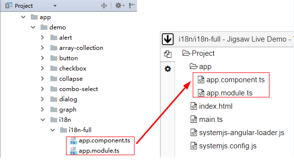

# 十分钟正则表达式实战，我们来用代码修改代码吧
我们今天来玩一个老掉牙的技术：正则表达式。这个文章也不是正则表达式的入门，网上有大把的入门文章可以看，我们这里谈的是正则表达式的实战。所以如果你对正则有一定基础的，推荐你仔细阅读，这个文章不会让你失望的。

## 辣么从哪开始呢？
这事要从这篇文章说起[《你所不知道的plunker用法 —— 分享Jigsaw七巧板的 Live Demo 解决方案》](...)，文章的最后提到我们实现了一个小工具用于将 Jigsaw (<https://github.com/rdkmaster/jigsaw>) 主工程中的demo代码转为可独立运行的plunker代码，我们今天就来看看这个工具是如何做到的。具体实现过程和 Jigsaw (<https://github.com/rdkmaster/jigsaw>) 工程耦合太重，没必要在本文展开，我们主要关注这个工具的正则表达式部分。没错，我们要做的，就是拿正则表达式来解析TypeScript代码，并将这些代码硬生生转为其他形态的代码。

## 先看看我们到底要做啥
看图说话



图的左边是原始的demo代码，我们的目的是要转为右边的代码。

> 骗子！不就把文件拷贝过去就行了吗？


好吧，在开始实现这个工具之前，我也是这么像的。

要做的事情实际上比你想的要多的多，罗列如下
- 修复 `templateUrl` 的值
- 修复 `styleUrls` 的值
- 修复Jigsaw的import
- 修复 `app.component.ts`
- 修复 `app.module.ts`
- 其他。由于这个文章只关注正则部分，所以和正则无关的事情，都归到这里啦。

下面就一个个来把。

<a name="template-url"></a>
## 修复 `templateUrl` 的值
这是最简单的一部分。

这个事情是为了解决systemjs在解析组件的模板url的时候，url不是 `./` 开头就会出错的问题。

> systemjs的逻辑好神奇不是吗？


把这样的一些代码

```
@Component({
    templateUrl: 'app.component.html'
})
```

转为

```
@Component({
    templateUrl: './app.component.html'
})
```

> 多数正则表达式已经入门的同学可能会说：简直是在侮辱我们的智商！

虽然简单，不过，这里头坑还是有的。

分分中我们就把正则写好了：

```
/\btemplateUrl\s*:\s*['"]\s*(.*)\s*['"]/g
```

匹配了一个关键字 `templateUrl`，前后还考虑了空格等因素，把url的值捕获出来：`(.*)`，除了对前后单双引号的匹配还需要改进外，其他的部分堪称完美。试一下：

`templateUrl: 'app.component.html'` 毫无意外的被转为了 `templateUrl: './app.component.html'`。

沾沾自喜了？别急，试一下这个

```
@Component({
    // 把两个属性写在同一行了
    templateUrl: 'app.component.html', selector: 'jigsaw-app'
})
```

替换后的结果是 `"app.component.html', selector: 'jigsaw-app"`，注意前后的双引号。由于我们偷懒没有捕获url的引号，所以无论是单引号还是双引号，都一律改为双引号，从而导致的这个结果。

问题出在我们捕获url值的 `(.*)` 这部分上了，熟悉正则的同学估计一眼就看出来问题出在 `*` 默认是贪婪的。我们预期只想捕获 `app.component.html` 这个串，但是由于 `*` 的贪婪，它捕获到了 `app.component.html', selector: 'jigsaw-app` 这个串了。问题的解决非常简单，只要让 `*` 不贪婪就好，改为 `(.*?)`。

总结：**深刻理解正则的贪婪模式和非贪婪模式是你从正则走向正则高手的第一个坎**。

## 修复 `styleUrls` 的值
这个修复的目的和 `templateUrl` 是一样的，都是要把url前面加是 `./`：

```
@Component({
    styleUrls: [
        'style1.css',
        'style2.css',
        'style3.css'
    ]
})
```

转为

```
@Component({
    styleUrls: [
        './style1.css',
        './style2.css',
        './style3.css'
    ]
})
```

**这里会用到另外一个技巧：如何匹配多行**

我们都知道，正则的元字符 `.` 就是用于匹配_任意字符_，但是在js引擎的正则实现，这里的_任意字符_却不包括换行符，即使开了多行模式也不行。换句话说，元字符 `.` 只能匹配一行内的任意字符。所以这里使用元字符 `.` 是无法达到我们的目的的。

不卖关子了，直接上答案，看这个表达式 `[\s\S]` 能够匹配的是啥？字面上看，它能够匹配一个_空格或者非空格_，换句话说，用它就能够匹配任意字符了。任意的字符要不就是空格，要不就不是空格，不是吗？所以，我们也是分分钟就把正则写好了：

```
/\bstyleUrls\s*:\s*(\[[\s\S]*?\])/g
```

要特别注意 `[\s\S]*?` 用的是非贪婪的匹配模式，否则又会出现和[前面](#template-url)处理templateUrl时碰到的类似问题了。

## 修复Jigsaw的import
这个小节我们来处理import，由于主工程上的demo代码引用的是本工程上的Jigsaw源码，而plunker上的demo需要引用npm包里的源码。举个例子吧，我们需要把下面的代码

```
import {NgModule} from "@angular/core";
import {TranslateModule, TranslateService} from "@ngx-translate/core";

import {JigsawAlertModule} from "jigsaw/component/alert/alert";
import {JigsawButtonModule} from "jigsaw/component/button/button";
import {PopupService} from "jigsaw/service/popup.service";
import {JigsawTimeModule} from "jigsaw/component/time/index";
import {JigsawRangeTimeModule} from "jigsaw/component/range-time/index";
import {TranslateHelper} from "jigsaw/core/utils/translate-helper";

import {I18nFullDemoComponent} from "./app.component";
```

转为

```
import {
    JigsawAlertModule, JigsawButtonModule, JigsawRangeTimeModule,
    JigsawTimeModule, PopupService, TranslateHelper,
} from "@rdkmaster/jigsaw";

import {NgModule} from "@angular/core";
import {TranslateModule, TranslateService} from "@ngx-translate/core";

import {I18nFullDemoComponent} from "./app.component";
```

很简单，把所有 `jigsaw/xxxx` 的包全部归类到一起，并按照每行3个来放，其他的import保持不变。我为了让这个例子尽可能的简单，所以把所有的 `jigsaw/xxxx` 的包都写在一起了，实际的代码并非如此，而是夹杂在各种各样的import语句中的，我们需要一一将他们挑出来、归类，注意import里的内容可能是多行的；还要保持其他的import代码格式不受破坏。看起来好像很难。

> 有人问：问啥要按照每行3个来放？
> 答案是：为了转后的代码格式好看。

完成这个实战的思路是，先要把所有被import进来的类和对应的文件都找出来，然后对他们进行分类，然后再还原回可用代码。

这个实战例子我们需要综合使用多行匹配，非贪婪匹配等这样的技巧了，同时，介绍一个新的技巧：**捕获**。其实前面已经都有用到捕获了，只是我们的关注点不在这上而已，现在我们来看看如何通过捕获让我们的代码变的简洁。

我们需要同时关注两个点：
- 被import进来的类；
- 这些类所在的文件；

所以，我们需要设置两个捕获，一个用于捕获类，一个用于捕获所在文件。我们知道，通过一对圆括号就可以实现一次捕获。写好的正则如下：

```
/\bimport\s+\{([\s\S]+?)\}\s+from\s+['"](.+?)['"]/
```

第一个捕获是 `([\s\S]+?)`，第二个捕获是 `(.+?)`。注意到两个捕获都是用的非贪婪模式。

那么，如何使用捕获到的文本呢？看下面的代码

```
var match = code.match(/\bimport\s+\{([\s\S]+?)\}\s+from\s+['"](.+?)['"]/);
```

变量 `match` 存放了所有当前这次匹配的所有信息，当然也包含了捕获的文本了。假如输入的 `code` 的值如下：

```
import {JigsawAlertModule} from "jigsaw/component/alert/alert";
```

那么，`match` 的值是：

```
0: "import {JigsawAlertModule} from "jigsaw/component/alert/alert""
1: "JigsawAlertModule"
2: "jigsaw/component/alert/alert"
index: 0
input: "import {JigsawAlertModule} from "jigsaw/component/alert/alert";"
length: 3
```

关键部分如下：
- `match[0]` 就是当前匹配到的文本；
- `match[1]` 就是第一个捕获的结果；
- `match[2]` 就是第二个捕获的结果；

如果正则中设置了更多的捕获，则match就有更大的length。

这样就行了，把捕获到的文本按照我们预期的组织就好了，具体代码就不写出来了，感兴趣看这里 <http://t.cn/R9Pg5NQ>

> 一个小坑：传递给 `code.match()` 的正则表达式如果把全局打开，则其返回值就不是前面说的样子了，它只包含所有的匹配项列表，捕获和索引信息全部丢失。打开全局开关的好处是无需自己写循环，副作用是得到的信息太少，平时使用时，要自己斟酌。

## 修复 `app.component.ts`
我们的启动组件就约定定义在 `app.component.ts` 文件内，但是这个文件内可以被定义很多个组件，那到底哪个是启动组件呢？这个地方特别麻烦，到底哪个组件是启动组件，需要到 `app.module.ts` 中去找，找到了之后，再到 `app.component.ts` 文件中，给这个组件的渲染器增加一个 `selector` 属性。需要用到多个正则表达式配合使用，具体看这里 <http://t.cn/R9PsJnL>

## 修复 `app.module.ts`
我们需要在这个文件中引入Angular启动需要的一些类，比如 `BrowserModule, BrowserAnimationsModule, HttpModule` 等。具体看这里 <http://t.cn/R9hvtDA>

## 结论
我们今天好好的玩了一把正则，如果 <http://t.cn/R9Pg5NQ> 这些代码你都能一一看懂，那恭喜你，你已经进入正则的高手阶段了。从正则新手进阶为正则高手，除了要掌握本文的各种技巧外，有一点很重要，就是不能害怕它。尽量多用，熟能生巧。

> 如何从正则的高手进阶为大神？
> 不知道。但是你自己实现一个markdown的解析器之后，相信大家都会管你叫大神了。