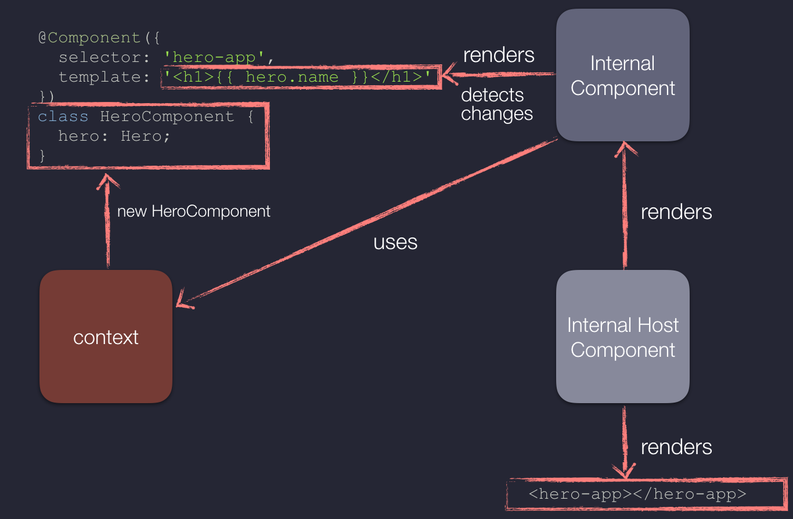
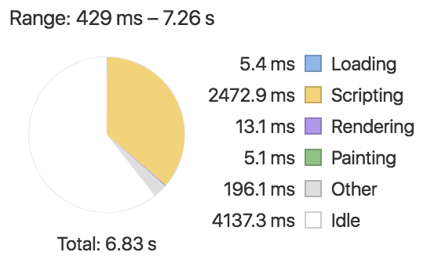
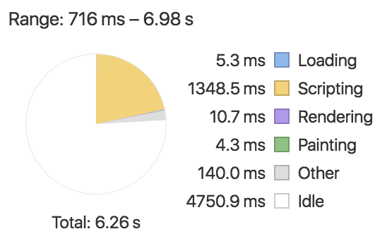

# 译文 | Angular中的AoT编译

> 前两天，Jigsaw七巧板上来了个issue <https://github.com/rdkmaster/jigsaw/issues/113>，[@jackjoy](https://github.com/jackjoy) 在issue中提到了一篇介绍Angular AoT的文章，我看了一下，觉得讲的非常好，还涉及到一些Angular编译原理的内容。于是打算翻译一下，让大伙都能够读一读，多了解一点AoT知识。
>
> 文中的第一人称“我”均指代作者本人(<http://blog.mgechev.com>)
>
> 原文地址是 <http://blog.mgechev.com/2016/08/14/ahead-of-time-compilation-angular-offline-precompilation/>

最近我给angular-seed增加了对Ahead-of-Time（AoT）编译的支持，这引来了不少关于这个新特性的问题。我们从下面这些话题开始来回答这些问题：
- 为什么Angular需要编译？
- 什么东西会被编译？
- 他们是如何被编译的？
- 编译发生在什么时候？JiT vs AoT
- 我们从AoT中获得了什么？
- AoT编译是如何工作的？
- 我们使用AoT和JiT的代价是什么？

## 为什么Angular需要编译？
这个问题的简短回答是：**编译可以让Angular应用达到更高层度的运行效率**，我所说的效率，主要是指的性能提升，但也包括电池节能和节省流量。

AngularJs1.x 有一个实现渲染和变化检测的很动态的方式，比如AngularJs1.x的编译器非常通用，它被设计为任何模板实现一系列的动态计算，虽然它在通常情况下运行的很好，但是JS虚拟机的动态特性让一些低层次的计算优化变得很困难。**由于js虚拟机无法理解那些我们作为脏检查的上下文对象（术语为scope）的形态，虚拟机的内联缓存常常不精确，这导致了运行效率的下降**。

> 译者：scope是AngularJs1.x中的一个重要对象，他是AngularJs1.x用于计算模板的上下文。

Angular2+采用了一个不同的方式。在给每个组件做渲染和变化检测的时候，它不再使用同一套逻辑，框架在运行时或者编译时会**生成**对js虚拟机友好的代码。**这些友好的代码可以让js虚拟机在属性访问缓存，执行变化检查，进行渲染的逻辑执行的快的多**。

举个例子，看看下面的代码：

```
// ...
Scope.prototype.$digest = function () {
  'use strict';
  var dirty, watcher, current, i;
  do {
    dirty = false;
    for (i = 0; i < this.$$watchers.length; i += 1) {
      watcher = this.$$watchers[i];
      current = this.$eval(watcher.exp);
      if (!Utils.equals(watcher.last, current)) {
        watcher.last = Utils.clone(current);
        dirty = true;
        watcher.fn(current);
      }
    }
  } while (dirty);
  for (i = 0; i < this.$$children.length; i += 1) {
    this.$$children[i].$digest();
  }
};
// ...
```

这个代码片段来自《轻量级angularJs1.x实现》一文。这些代码实现了对scope树做深度优先搜索，目的是为了寻找绑定数据的变化，这个方法对任何指令都生效。这些代码显然比下面这些直接指定检查的代码慢：

```
// ...
var currVal_6 = this.context.newName;
if (import4.checkBinding(throwOnChange, this._expr_6, currVal_6)) {
    this._NgModel_5_5.model = currVal_6;
    if ((changes === null)) {
        (changes = {});
    }
    changes['model'] = new import7.SimpleChange(this._expr_6, currVal_6);
    this._expr_6 = currVal_6;
}
this.detectContentChildrenChanges(throwOnChange);
// ...
```

> 译者：
>
> 《轻量级angularJs1.x实现》的地址是 <https://github.com/mgechev/light-angularjs/blob/master/lib/Scope.js#L61-L79
>
> 这里一下子提及了angularJs1.x的好几个概念，包括scope，数据绑定，指令。不熟悉angularJs1.x的同学理解起来费劲，想弄懂的话，自行搜索吧。个人认为可以无视，毕竟这个文章的重点不是在这里。你就认为Angular2+的处理方式比angularJs1.x牛逼很多就好了，哈哈。

上面代码包含了一个来自angular-seed的某个编译后的组件的代码，这些代码是由编译器生成的，包含了一个 `detectChangesInternal` 方法的实现。Angular框架通过直接属性访问的方式读取了数据绑定中的某些值，并且采用了最高效的方式与新的值做比较。一旦Angular框架发现这些值发生了变化，它就立即更新只受这些数据波及的DOM元素。

在回答了“为什么Angular需要编译”这个问题的同时，我们同时也回答了“什么东西会被编译”这个问题。我们希望把组件的模板编译成一个JS类，这些类包含了在绑定的数据中检测变化和渲染UI的逻辑。通过这个方式，我们和潜在的平台解耦了。换句话说，通过对渲染器采取了不同的实现，我们在不对代码做任何的修改的前提下，就可以对同一个以AoT方式编译的组件做不同的渲染。比如，上述代码中的组件还可以直接用在NativeScript中，这是由于这些不同的渲染器都能够理解编译后的组件。

## 编译发生在什么时候？JiT 还是 AoT


Angular编译器最cool的一个点是它可以在页面运行时（例如在用户的浏览器内）启动，也可以作为构建的一个步骤在页面的编译时启动。这主要得益于Angular的可移植性：我们可以在任何的平台的JS虚拟机上运行Angular，所以我们完全可以在浏览器和NodeJs中运行它。

### JiT编译模式的流程
一个典型的非AoT应用的开发流程大概是：

- 使用TypeScript开发Angular应用
- 使用`tsc`来编译这个应用的ts代码
- 打包
- 压缩
- 部署

一旦把app部署好了，并且用户在浏览器中打开了这个app，下面这些事情会逐一进行：

- 浏览器下载js代码
- Angular启动
- Angular在浏览器中开始JiT编译的过程，例如**生成**app中各个组件的js代码
- 应用页面得以渲染

### AoT编译模式的流程
相对的，使用AoT模式的应用的开发流程是：

- 使用TypeScript开发Angular应用
- 使用`ngc`来编译应用
    - 使用Angular编译器对模板进行编译，**生成TypeScript代码**
    - TypesScript代码编译为JavaScript代码
- 打包
- 压缩
- 部署

虽然前面的过程稍稍复杂，但是用户这一侧的事情就变简单了：

- 下载所以代码
- Angular启动
- 应用页面得以渲染

如你所见，第三步被省略掉了，这意味着页面打开更快，用户体验也更好。类似Angular-cli和Angular-seed这样的工具可以让整个编译过程变的非常的自动化。

概括起来，Angular中的Jit和AoT的主要区别是：
- 编译过程发生的时机
- JiT生成的是JS代码，而AoT生成的是TS代码。这主要是因为JiT是在浏览器中进行的，它完全没必要生成TS代码，而是直接生产了JS代码。

你可以在我的Github账号中找到一个最小的AoT编译demo，链接在这里 <https://github.com/mgechev/angular2-ngc-rollup-build>

## 深入AoT编译


这个小节回答了这些问题：
- AoT编译过程产生了什么文件？
- 这些产生的文件的上下文是什么？
- 如何开发出AoT友好又有良好封装的代码？

对`@angular/compiler`的代码一行一行的解释没太大意义，因此我们仅仅来快速过一下编译的过程。如果你对编译器的词法分析过程，解析和生成代码过程等感兴趣，你可以读一读Tobias Bosch的《Angular2编译器》一文，或者它的胶片。

> 译者：
>
> 《Angular2编译器》一文链接 <https://www.youtube.com/watch?v=kW9cJsvcsGo>
>
> 它的胶片链接 <https://speakerdeck.com/mgechev/angular-toolset-support?slide=69>

Angular模板编译器收到一个组件和它的上下文（可以这认为是组件在组件树上的位置）作为输入，并产生了如下文件：
- `*.ngfactory.ts` 我们在说明组件上下文的小节会仔细看看这些文件
- `*.css.shim.ts` 样式作用范围被隔离后的css文件，根据组件所设置的 `ViewEncapsulation` 模式不同而会有不同
- `*.metadata.json` 当前组件/模块的装饰器元数据信息，这些数据可以被想象成以json格式传递给 `@Component` `@NgModule` 装饰器的信息。

`*` 是一个文件名占位符，例如对于`hero.component.ts`这样的组件，编译器生成的文件是 `hero.component.ngfactory.ts`, `hero.component.css.shim.ts` 和 `hero.component.metadata.json`。`*.css.shim.ts`和我们讨论的主题关系不大，因此不会对它详细描述。如果你希望多了解 `*.metadata.json` 文件，你可以看看“AoT和第三方模块”小节。

### `*.ngfactory.ts` 的内部结构
它包含了如下的定义：
- `_View_{COMPONENT}_Host{COUNTER}` 我们称之为**internal host component**
- `_View_{COMPONENT}{COUNTER}` 我们称之为 **internal component**

以及下面两个函数
- `viewFactory_{COMPONENT}_Host{COUNTER}`
- `viewFactory_{COMPONENT}{COUNTER}`

其中的 `{COMPONENT}` 是组件的控制器名字，而 `{COUNTER}` 是一个无符号整数。他们都继承了 `AppView`，并且实现了下面的方法：
- `createInternal` 组件的渲染器
- `destroyInternal` 执行事件监听器等的清理
- `detectChangesInternal` 以内联缓存优化后的逻辑执行变化检测

上述这些工厂函数只在生成的`AppView`实例中才存在。

我前面说过，`detectChangesInternal`中的代码是JS虚拟机友好的。

```
<div>{{newName}}</div>
<input type="text" [(ngModel)]="newName">
```

我们来看看编译后这个模板的代码，`detectChangesInternal`方法的代码看起来像是这样的：

```
// ...
var currVal_6 = this.context.newName;
if (import4.checkBinding(throwOnChange, this._expr_6, currVal_6)) {
    this._NgModel_5_5.model = currVal_6;
    if ((changes === null)) {
        (changes = {});
    }
    changes['model'] = new import7.SimpleChange(this._expr_6, currVal_6);
    this._expr_6 = currVal_6;
}
this.detectContentChildrenChanges(throwOnChange);
// ...
```

假设`currVal_6`的值是3，`this_expr_6`的值是1，我们来跟踪看看这个方法的执行。对于这样的一个调用 `import4.checkBinding(1, 3)`，在生产环境下，`checkBinding` 执行的是下面的检查：

```
1 === 3 || typeof 1 === 'number' && typeof 3 === 'number' && isNaN(1) && isNaN(3);
```

上述表达式返回`false`，因此我们将把变化保持下来，以及直接更新 `NgModel` 的属性 `model` 的值，在这之后，`detectContentChildrenChanges` 方法会被调用，它将为整个模板内容的子级调用 `detectChangesInternal`。一旦 `NgModel` 指令发现了 `model` 属性发生了变化，它就会（几乎）直接调用渲染器来更新对应的DOM元素。

目前为止，我们还没有碰到任何特殊的，或者特别复杂的逻辑。

### `context` 属性
也许你已经注意到了在**internal component**内部访问了 `this.context` 属性。

> 译者：**internal component** 指的前一小节的 `_View_{COMPONENT}{COUNTER}` 函数

**internal component**中的 `context` 是这个组件的控制器的实例，例如这样的一个组件：

```
@Component({
  selector: 'hero-app',
  template: '<h1>{{ hero.name }}</h1>'
})
class HeroComponent {
  hero: Hero;
}
```

`this.context` 就是 `new HeroComponent()`，这意味着如果在 `detectChangesInternal` 中我们需要访问 `this.context.name` 的话，就带来了一个问题：**如果我们使用AoT模式编译组件的模板，由于这个模式会生成TypeScript代码，因此我们要确保在组件的模板中只访问 `this.context` 中的public成员**。这是为何？由于TypeScript的类属性有访问控制，强制类外部只能访问类（及其父类）中的public成员，因此在**internal component**内部我们无法访问 `this.context` 的任何私有成员。因此，下面这个组件：

```
@Component({
  selector: 'hero-app',
  template: '<h1>{{ hero.name }}</h1>'
})
class HeroComponent {
  private hero: Hero;
}
```

以及这个组件

```
class Hero {
  private name: string;
}

@Component({
  selector: 'hero-app',
  template: '<h1>{{ hero.name }}</h1>'
})
class HeroComponent {
  hero: Hero;
}
```

在生成出来的 `*.ngfactory.ts` 中，都会抛出编译错误。第一个组件代码，**internal component**无法访问到在 `HeroComponent` 类中被声明为 private 的 `hero` 属性。第二个组件代码中，**internal component**无法访问到 `hero.name` 属性，因为它在 `Hero` 类中被声明为private。

### AoT与封装
好吧，我们只能在组件模板中绑定public属性，以及调用public方法。但是，如何确保组件的封装性？在开始的时候，这可能不是一个大问题，但是想象一下下面这个场景：

```
// component.ts
@Component({
  selector: 'third-party',
  template: `
    {{ _initials }}
  `
})
class ThirdPartyComponent {
  private _initials: string;
  private _name: string;

  @Input()
  set name(name: string) {
    if (name) {
      this._initials = name.split(' ').map(n => n[0]).join('. ') + '.';
      this._name = name;
    }
  }
}
```

这个组件有一个属性 `name`，它只能写入而无法读取。在 `name` 属性的 setter 方法中，计算了 `_initials` 属性的值。

我们可以用类似下面的方式使用这个组件：

```
@Component({
  template: '<third-party [name]="name"></third-party>'
  // ...
})
// ...
```

在JiT编译模式下，一切正常，因为JiT模式只生成JavaScript代码。每次 `name` 属性的值发生变化，`_initials` 就会被重新计算。但是，这个组件却不是AoT友好的，必须改为：

```
// component.ts
@Component({
  selector: 'third-party',
  template: `
    {{ initials }}
  `
})
class ThirdPartyComponent {
  initials: string;
  private _name: string;

  @Input()
  set name(name: string) {...}
}
```

codelyzer 这个工具可以确保你在模板中每次都能访问到public成员。

这让组件的使用者可以这样做：

```
import {ThirdPartyComponent} from 'third-party-lib';

@Component({
  template: '<third-party [name]="name"></third-party>'
  // ...
})
class Consumer {
  @ViewChild(ThirdPartyComponent) cmp: ThirdPartyComponent;
  name = 'Foo Bar';

  ngAfterViewInit() {
    this.cmp.initials = 'M. D.';
  }
}
```

对public属性 `initials` 的直接修改导致了组件处于不一致性的状态：组件的 `_name` 的值是 `Foo Bar`，但是它的 `initials` 的值是 `M. D.`，而非 `F. B.`。

在Angular的源码中，我们可以找到解决的办法，使用TypeScript的 `/** @internal */` 注释声明，就能够达到既保证组件代码对AoT友好，又能够确保组件的封装良好的目的。

```
// component.ts
@Component({
  selector: 'third-party',
  template: `
    {{ initials }}
  `
})
class ThirdPartyComponent {
  /** @internal */
  initials: string;
  private _name: string;

  @Input()
  set name(name: string) {...}
}
```

`initials` 属性仍然是public的。我们在使用 `tsc` 编译这个组件时，设置 `--stripInternal` 和 `--declarations` 参数，`initials` 属性就会从组件的类型定义文件（即 `.d.ts` 文件）中被删掉。这样我们就可以做到在我们的类库内部使用它，但是我们的组件使用者无法使用它。

#### `ngfactory.ts` 概要
我们来对幕后所发生的一切做一些概要描述。拿我们前面的例子中的 `HeroComponent` 为例，Angular编译器会生成两个类：

- `_View_HeroComponent_Host1` 这是 **internal host component**
- `_View_HeroComponent1` 这是 **internal component**

`_View_HeroComponent1` 负责渲染这个组件的模板，以及进行变化检测。在执行变化检测时，它会对 `this.context.hero.name`之前保存的值和当前值做比较，一旦发现这两个值不一致，`<h1/>`元素就会被更新，这意味着我们必须保持 `this.context.hero` 和 `hero.name` 是public的。这一点可以通过 codelyzer 这个工具来辅助确保。

另外，`_View_HeroComponent_Host1` 则负责 `<hero-app></hero-app>` 和 `_View_HeroComponent1` 本身的渲染。

这个例子可以以下面这个图来总结：



## AoT vs JiT 开发体验
这个小结，我们来讨论使用AoT开发和JiT开发的另一种体验。

可能使用JiT对开发体验的冲击最大的就是JiT模式为**internal component**和**internal host component**生成的是JavaScript代码，这意味着组件的控制器中的属性都是public的，因此我们不会得到任何编译错误。

在JiT模式下，一旦我们启动了应用，根组件的根注入器和所有的指令就已经准备就绪了（他们被包含在 `BrowserModule` 和其他所有我们在根模块中引入的模块中了）。元数据信息会传递给编译器，用于对根组件的模板的编译。一旦编译器生成了JiT下的代码，编译器就拥有了用于生成各个子组件的所有元数据信息。由于编译器此时不仅知道了当前层级的组件有那些provider可用，还可以知道那些指令是可见的，因此它可以给所有的组件生成代码。

这一点让编译器在访问了模板中的一个元素时，知道该怎么工作。根据是否有选择器是 `bar-baz` 的指令/组件，`<bar-baz></bar-baz>` 这样的一个元素就有了两种不同的解释。编译器在创建了 `<bar-baz></bar-baz>` 这样的一个元素的同时，是否还同时初始化 `bar-baz` 对应的组件类的实例，则完全取决于当前阶段的编译过程的元数据信息。

这里有一个问题，在编译阶段，我们如何知道指令在整个组件树上是否可访问？得益于Angular框架的良好设计，我们通过静态代码分析就可以做到。Chuck Jazdzewski 和 Alex Eagle 在这个方向上做出了令人惊叹的成果，他们实现了 `MetadataCollector` 和相关的模块。`MetadataCollector` 所做的事情就是通过遍历组件树来获取每个组件和`NgModule`的元数据信息，这个过程中，很多牛逼的技术被用到，可惜这些技术超出了本文的范畴。

### AoT与第三方模块
为了编译组件的模板，编译器需要组件的元数据信息，我们来假设我们的应用使用到了一些第三方组件，Angular的AoT编译器是如何获取这些已经被编译成JavaScript代码的组件的元数据信息的？**这些组件库必须连带发布对应的 `*.metadata.json` 文件，这样才能够对一个引用了它的页面进行AoT编译。**

如果你想了解如何使用Angular编译器，例如如何编译你自定义库使得他们能够被用于以AoT编译的应用，那请访问这个链接 <https://github.com/angular/mobile-toolkit/blob/master/app-shell/gulpfile.ts#L52-L54>

## 我们从AoT中获得了什么？
你可能已经想到了，AoT给我们带来了性能的提升。以AoT方式开发的Angular应用的初次渲染性能要比JiT的高的多，这是由于JS虚拟机需要的计算量大大减少了。我们只在开发过冲中，将组件的模板编译成js代码，在此之后，用户不需要等待再次编译。

下面这个图中，可以看出JiT渲染方式在初始化过程中所消耗的时间：



下面这个图你可以看出AoT方式初始化在初始化过程中所消耗的时间：



Angular编译器不仅能够生产JavaScript，还能够生成TypeScript，这一点还带给我们要给非常棒的特性：在模板中进行类型检查。

由于应用的模板是纯JavaScript/TypeScript，我们可以精确的知道哪些东西在哪被用到了，这一点让我们可以对代码进行**有效的摇树操作**，它能够把所有的未使用过的指令/模块从我们生产环境中的应用代码包中给删除掉。这首要的一点是，我们的应用程序代码包中，再也无需包含 `@angular/compiler` 这个模块，因为我们在应用的运行时根本就用不到它。

**有一点需要注意的是，一个中大型的应用代码包，在进行AoT编译过之后，可能会比使用JiT方式编译的代码包要大一些**。这是因为 `ngc` 生成的对JS虚拟机友好的代码比基于HTML模板的代码要冗长一些，并且这些代码还包含了脏检查逻辑。如果你想降低你的应用代码的尺寸，你可以通过懒加载的方式来实现，Angular内建的路由已经支持这一点了。

**在某些场合，JiT模式的编译根本就无法进行**，这是由于JiT在浏览器中，不仅生成代码，它还使用 `eval` 来运行它们，浏览器的内容安全策略以及特定的环境不允许这些被生成的代码被动态的运行。

最后一个但不是唯一的：**节能**！在接受到的是编译后的代码时，用户的设备可以花更少的时间运行他们，这节约了电池的电力。节能的量有多少呢？下面是我做的一些有趣的计算的结果：

基于《Who Killed My Battery: Analyzing Mobile Browser Energy Consumption》这偏文章的结论，访问Wikipedia时，下载和解析jQuery的过程大约需要消耗4焦耳的能量。这个文章没有提及所使用的jQuery的确切版本，基于文章发表的日期，我估计版本号是1.8.x。Wikipedia采用了gzip对静态资源做压缩，这意味着jQuery1.8.3的尺寸约33k。而被最小化并且gzip压缩后的 `@angular/compiler` 包的尺寸在103k，这意味着对这些代码的下载和解析需要消耗12.5焦的能量（我们可以忽略JiT的运算还会增加能耗的事实，这是因为jQuery和`@angular/compiler`这两个场景，都是使用了要给单一的TCP链接，这从是最大的能耗所在）。

iPhone6s的电池容量是6.9Wh，即24840焦。基于AngularJs1.x官网的月访问量可以得知现在大约有一百万名Angular开发者，平均每位开发者构建了5个应用，每个应用每天约100名用户。5个app * 1m * 100用户 = 500m，在使用JiT编译这些应用，他们就需要下载 `@angular/compiler` 包，这将给地球带来 500m * 12.5J = 6250000000J焦（=1736.111111111千瓦时）的能量消耗。根据Google搜索结果，1千瓦时约等于12美分，这意味着我们每天需要消耗约 210 美元。注意到我们还没进一步对代码做摇树操作，这可能会让我们的应用程序代码降低至少一半！


## 结论
Angular的编译器利用了JS虚拟机的内联缓存机制，极大的提升了我们的应用程序的性能。首要的一点是我们把编译过程作为构建应用的一个环节，这不仅解决了非法`eval`的问题，还允许我们对代码做高效的摇树，降低了首次渲染的时间。

不在运行时编译是否让我们失去是什么吗？在一些非常极端的场景下，我们会按需生成组件的模板，这就需要我们价值一个未编译的组件，并在浏览器中执行编译的过程，在这样的场景下，我们就需要在我们的应用代码包中包含 `@angular/compiler` 模块。AoT编译的另一个潜在缺点是，它会造成中大型应用的代码包尺寸变大。由于生成的组件模板的JavaScript代码比组件模板本身的尺寸更大，这就可能造成最终代码包的尺寸更大一些。

总的来说，AoT编译是一个很好的技术，现在它已经被集成到了Angular-seed和`angular-cli`中，所以，你今天就可以去使用它了。

## 参考资料
- 内联缓存 <http://mrale.ph/blog/2012/06/03/explaining-js-vms-in-js-inline-caches.html>
- 2.5X Smaller Angular 2 Applications with Google Closure Compiler <http://blog.mgechev.com/2016/07/21/even-smaller-angular2-applications-closure-tree-shaking/>
- Who Killed My Battery: Analyzing Mobile Browser Energy Consumption <https://crypto.stanford.edu/~dabo/pubs/abstracts/browserpower.html>
- Angular的源码 <https://github.com/angular/angular>


## 题外话

这些文章都是我们在研发Jigsaw七巧板过程中的技术总结，如果你喜欢这个文章，请帮忙到 Jigsaw七巧板的工程上点个星星鼓励我们一下（点击阅读原文看直达 <https://github.com/rdkmaster/jigsaw>），这样我们会更有动力写出类似高质量的文章。Jigsaw七巧板现在处于起步阶段，非常需要各位的呵护。