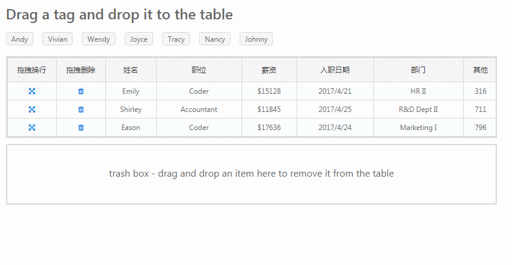
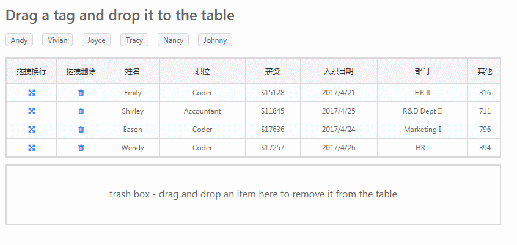
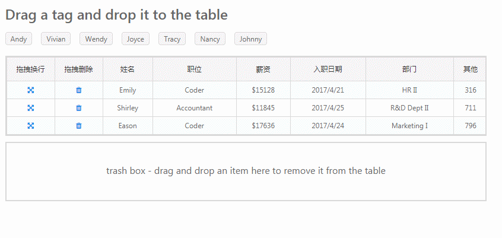

# h5的drag&drop在jigsaw中的实现

## 概念
- drag target(拖拽元素) 被拖动的元素
- drop target(拖放目标) 被放入的元素

## DragEvent
   
### 拖动元素涉及到的事件
- `dragstart` 开始拖拽
- `drag` 拖拽中
- `dragend` 结束拖拽
- `dragexit` 当拖拽目标不再是当前元素时触发

注: 让一个元素可拖拽,需要在元素上添加属性 `draggable="true"`
  
### 拖放目标涉及到的事件
- `dragenter` 拖拽进入拖放目标
- `dragover` 拖拽位于拖放目标之上
- `dragleave` 拖拽离开拖放目标
- `drop` 拖拽元素在拖放目标中被放下

注: 需要在`dragover`事件中静止鼠标默认事件，不然`drop`事件无法触发

## DataTransfer对象
在拖放操作中被保存的拖放数据

### 属性
- `effectAllowed: string` 拖拽对象赋予的拖放行为
- `dropEffect: string` 拖放目标接受的拖放行为

注: 这里的拖放行为只有三种'move'、'copy'、'link',用户是不可以自定义的

#### effectAllowed可能的值
- copy: 复制到新的位置.
- move: 移动到新的位置 .
- link: 建立一个源位置到新位置的链接.
- copyLink: 允许复制或者链接.
- copyMove: 允许复制或者移动.
- linkMove: 允许链接或者移动.
- all: 允许所有的操作.
- none: 禁止所有操作.
- uninitialized: 缺省值（默认值）, 相当于 all.

#### dropEffect可能的值
- copy: 复制到新的位置
- move: 移动到新的位置
- link: 建立一个源位置到新位置的链接
- none: 禁止放置（禁止任何操作）

### 方法
- `setData(format: string, data: string): boolean`
- `getData(format: string): string`
- `clearData(format?: string): boolean`
- `setDragImage(image: Element, x: number, y: number): void`

#### setData
一般在`dragstart`的时候设置需要传递的数据

参数:
- `format` 一般是'text'或者'url',
- `data` 需要注意的是data参数也是字符串类型的,如果想传递一个对象需要用`JSON.stringify`
```javascript
dragNode.addEventListener("dragstart", function( event ) {
    event.dataTransfer.setData('text', JSON.stringify(obj));
});
```

#### getData
一般在`drop`里获取传递的数据

如果数据是个对象,前面设置数据时转成了json字符串,这边需要解析
```javascript
dropNode.addEventListener("drop", function( event ) {
    const data = JSON.parse(event.dataTransfer.getData('text'));
});
```

#### clearData
一般在`dragend`里面清除数据
```javascript
dragNode.addEventListener("dragend", function( event ) {
    event.dataTransfer.clearData("text");
});
```

#### setDragImage
自定义一个期望的拖动时的图片。默认情况下,被拖动的节点创建成默认图片。
```javascript
dragNode.addEventListener("dragstart", function( event ) {
    event.dataTransfer.setDragImage(event.target, 0, 0);
});
```

## 在jigsaw中的实现

### 封装成指令
把拖拽元素和拖放目标封装成两个指令,绑定各自的事件
```javascript
@Directive({
    selector: '[jigsaw-draggable], [jigsawDraggable]',
    host: {
        '[attr.draggable]': 'true',
        '(selectstart)': '_selectStartHandle($event)',
        '(dragstart)': '_dragStartHandle($event)',
        '(dragend)': '_dragEndHandle($event)',
        '(mousedown)': '_mouseDownHandle($event)'
    }
})
export class JigsawDraggable implements OnInit, OnDestroy {}
```
```javascript
@Directive({
    selector: '[jigsaw-droppable], [jigsawDroppable]',
    host: {
        '(dragenter)': '_dragEnterHandle($event)',
        '(dragleave)': '_dragLeaveHandle($event)',
        '(drop)': '_dropHandle($event)'
    }
})
export class JigsawDroppable implements OnInit, OnDestroy {}
```

创建各自事件对应的`EventEmitter`事件，在各自的事件回调中发出,并在实例中订阅。
可以封装一个数据对象，把原生event，dom等放进去，然后通过`EventEmitter`发给实例。
```
export class JigsawDraggable implements OnInit, OnDestroy {
    @Output()
    public jigsawDragEnter: EventEmitter<DragDropInfo> = new EventEmitter<DragDropInfo>();
    
    private _dragEnterHandle(event) {
        /*拖拽元素进入目标元素头上的时候*/
        event.stopPropagation();
        this.jigsawDragEnter.emit(new DragDropInfo(event));
        return true;
    }
}
```

订阅事件
```html
<div class="drag-box"
     jigsaw-draggable
     (jigsawDragStart)="dragStartHandle($event)"
     (jigsawDragEnd)="dragEndHandle($event)">
</div>

<div class="drop-box"
     jigsaw-droppable
     (jigsawDragEnter)="dragEnterHandle($event)"
     (jigsawDragOver)="dragOverHandle($event)"
     (jigsawDrop)="dropHandle($event)"
</div>     
```

回调处理
```
dragStartHandle(dragInfo){
    dragInfo.dragDropData = 'this is data';
    dragInfo.event.dataTransfer.effectAllowed = 'link';
    dragInfo.event.dataTransfer.setDragImage(dragInfo.event.target, 10, 10);
}
```

### 一个页面有多种拖拽行为,比如增加,移动,删除等
可以给每个拖拽行为设置不同的`effectAllowed`,但最多只能设置三种,'move'、'copy'、'link',
可以不用管这三种拖拽行为的字面意思,仅作区分用。然后在拖放目标的`dragenter`和`dragover`事件
中设置`dropEffect`,把它设置成对应类型,这样就能区分不同的拖拽了。
```
dragStartHandle(dragInfo){
    dragInfo.event.dataTransfer.effectAllowed = 'copy';
}

dragEnterHandle(dragInfo){
    dragInfo.event.dataTransfer.dropEffect = 'copy';
}

dragOverHandle(dragInfo){
    dragInfo.event.dataTransfer.dropEffect = 'copy';
}
```




### 拖入高亮效果
拖放目标的dragover和dragleave，可以模拟鼠标的hover行为
```
dragOverHandle(dragInfo){
    dragInfo.event.target.style.borderColor = '#108ee9';
}

dragLeaveHandle(dragInfo){
    dragInfo.event.target.style.borderColor = '#d9d9d9';
}
```


## url地址
jigsaw项目(<https://github.com/rdkmaster/jigsaw>)

demo地址(<http://rdk.zte.com.cn/component/dragdrop/table-drag>)
