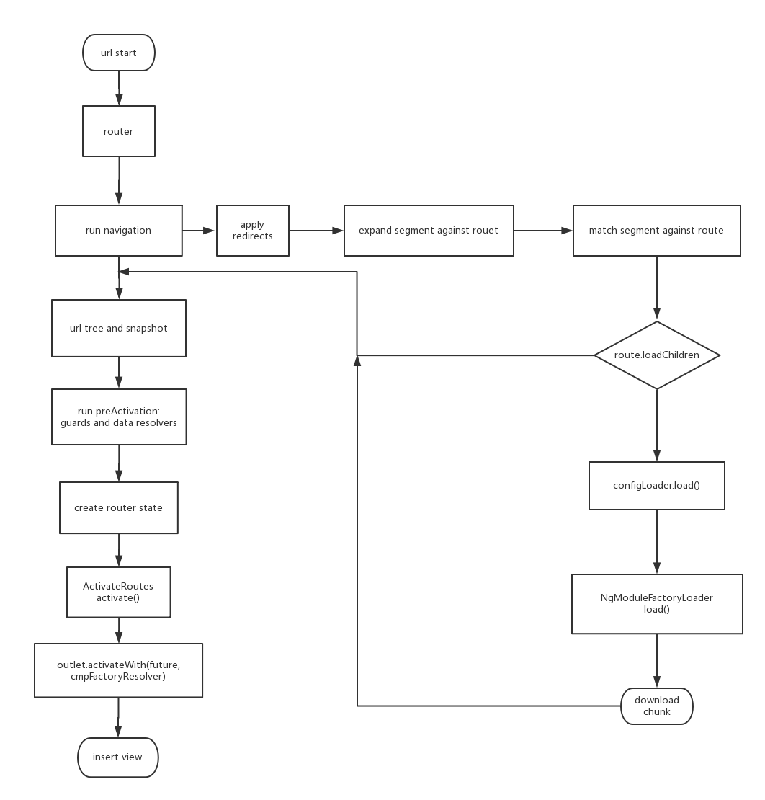

# 解析angular路由的懒加载是如何实现的

## 在angular项目中配置懒加载路由

比如AppModule中引入带loadChildren的路由
```
const appRoutes = [
    {
        path: 'button',
        loadChildren: './button/demo.module#ButtonDemoModule'
    }
];

@NgModule({
    declarations: [AppComponent],
    imports: [
        RouterModule.forRoot(appRoutes)
    ],
    bootstrap: [AppComponent]
})
export class AppModule {
}
```

在ButtonDemoModule中配置路由导航
```
const buttonDemoRoutes = [
    {
        path: 'basic', component: ButtonBasicDemoComponent
    }
];

@NgModule({
    declarations: [ButtonBasicDemoComponent],
    imports: [
        RouterModule.forChild(buttonDemoRoutes)
    ]
})
export class ButtonDemoModule {
}
```

加载效果： 


## 路由懒加载在Angular里的处理流程
我们在路由模块中的配置，实际上是一个Route对象组成的数组，路由组件会根据浏览器的url和这个Routes数组，
找到这段路由的配置信息，里面包含对应的组件、路由插座、是否有守护、数据等信息，其中也会有loadChildren
信息，路由在处理url时，会判断是否有loadChildren，如果有，会执行在路由模块注入的NgModuleFactoryLoader服务，
从后端下载对应的包文件，然后再执行路由的后续加载组件视图的操作。这是大概的处理流程图：



## 路由懒加载是如何打包的
angular-cli是使用了webpack进行打包的，先看看webpack是如何实现懒加载的。

### webpack是如何打包的
比如js中引用了第三方插件，我们现在要对第三方插件进行懒加载，可以在js代码中使用require.ensure，webpack可以通过require.ensure区分正常require进行切片。

```javascript
require.ensure([], (require) => {
    require("bootstrap/dist/css/bootstrap.min.css");
    require("eonasdan-bootstrap-datetimepicker/build/css/bootstrap-datetimepicker.min.css");
    require("eonasdan-bootstrap-datetimepicker");
}, 'datepicker'); // datepicker就是定义的切片包名
```

在webpack.config.js中配置切片名
```
output: {
    path: helpers.root('dist'),
    filename: '[name].[hash].js',
    chunkFilename: '[name].[hash].chunk.js' // 切片命名
}
```

切片： 


加载效果：
 


那么问题来了，webpack是如何懒加载切片文件的呢？我们可以扒开打包后的文件来看看。

webpack打包后生成的文件里有三个重要的全局函数
```javascript
webpackJsonp
__webpack_require__
__webpack_require__.e
```

### webpackJsonp

webpack利用JSONP技术，先在浏览器定义好webpackJsonp这个函数，然后从后端下载用webpackJsonp进行封装的js，
浏览器获取这样的js文件就可以立即执行了。webpackJsonp的源码如下：

```javascript
(function(modules) {
 	window["webpackJsonp"] = function webpackJsonpCallback(chunkIds, moreModules, executeModules) {
 		// add "moreModules" to the modules object,
 		// then flag all "chunkIds" as loaded and fire callback
 		/*......*/
 		for(moduleId in moreModules) {
 			if(Object.prototype.hasOwnProperty.call(moreModules, moduleId)) {
 				modules[moduleId] = moreModules[moduleId];
 			}
 		}
 		/*......*/
 	};
})([]) 	
```
webpackJsonp有三个参数，chunkIds, moreModules和executeModules。其中chunkIds是包文件的标识；moreModules就是包文件自带的
modules，以moduleId一一对应，webpackJsonp会把包文件的modules复制到全局的modules；executeModules是要立即执行的模块。

webpack打包出来的文件都是用webpackJsonp这个函数封装起来的，类似于：
```javascript
webpackJsonp([12, 33],{
    111:
    (function(module, exports) {
        /*......*/
    }),
    
    112:
    (function(module, exports, __webpack_require__) {
        /*......*/
    }),
    /*......*/
})
```

### \_\_webpack\_require\_\_

主要根据moduleId从全局的modules加载模块。

### \_\_webpack\_require\_\_.e

通过动态插入script标签的方式，下载对应的chunk包文件，可以看看源码
```javascript
__webpack_require__.e = function requireEnsure(chunkId) {
    /*......*/
    var head = document.getElementsByTagName('head')[0];
    var script = document.createElement('script');
    script.type = 'text/javascript';
    script.charset = 'utf-8';
    /*......*/
 	script.src = __webpack_require__.p + "" + chunkId + ".chunk.js";
    /*......*/
    head.appendChild(script);
    return promise;
}
```

### angular-cli是如何打包的
angular-cli里面对webpack进行了定制化开发，不同于前面说的使用require.ensure进行切片打包，angular-cli
让webpack识别router里的'loadChildren'关键字进行打包。让我们来看看打包后的文件。

main.bundle.js
```javascript
var map = {
	"./button/demo.module": [
		919,
		11
	],
	"app/demo/demo-list": [
		923,
		23
	]
};
function webpackAsyncContext(req) {
	var ids = map[req];	if(!ids)
		return Promise.reject(new Error("Cannot find module '" + req + "'."));
	// __webpack_require__.e就是webpack用于懒加载的函数
	return __webpack_require__.e(ids[1]).then(function() {
		return __webpack_require__(ids[0]);
	});
};
```
可以看到webpack根据路由生成了一个url与数组ids对应的对象，url是用户在路由中配的loadChildren参数，ids[1]代表chunkId，也就是对应的包文件，
ids[0]代表moduleId，即需要加载的模块。在webpackAsyncContext这个函数中，\_\_webpack_require\_\_.e通过chunkId从后端下载到chunk包文件，然后
\_\_webpack\_require\_\_通过moduleId加载到对应的模块。

button-demo-module对应的切片包 11.chunk.js
```javascript
webpackJsonp([11,32],{
    919: (function(module, __webpack_exports__, __webpack_require__) {
        /* harmony export (binding) */
        __webpack_require__.d(__webpack_exports__, "ButtonDemoModule", function() { return ButtonDemoModule; });
        var ButtonDemoModule = (function () {
            function ButtonDemoModule() {
            }
            return ButtonDemoModule;
        }());
    })
})
```
用户浏览器输入localhost:4200/button/basic，RouterMoudule会通过注入的NgModuleFactoryLoader
调取angular-cli的webpackAsyncContext函数。webpackAsyncContext通过map拿到对应的chunkId，调用__webpack_require__.e的动态下载对应的chunk包文件，下载
完成后，调用__webpack_require__执行对应的模块。这个过程就是angilar-cli加载路由的loadChildren的过程。


