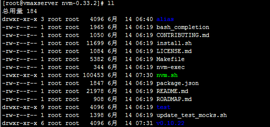
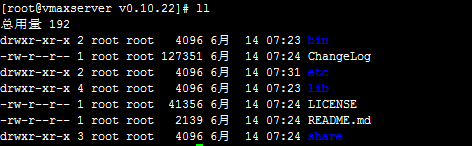
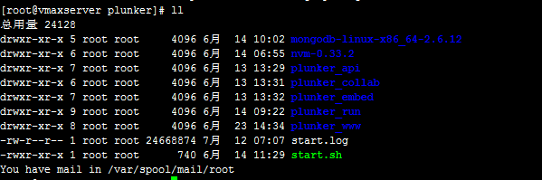

# Install NodeJS v0.10.22 and NPM
linux环境的话，最好安装 https://github.com/creationix/nvm 用来管理node版本的工具，可以自由切换版本。

安装完之后到 https://npm.taobao.org/mirrors/node/v0.10.22/ 目录下载合适的node版本包。解压缩到nvm的文件夹中，目录结构如下

v0.10.22文件夹下面的结构如下

# Install plunker_api
    git clone https://github.com/filearts/plunker_api.git
    cd plunker_api
    git checkout 9370605fa6d73db18a450cb11e02a730633d9b02

然后

    npm install

并且将 [config.api.example.json](config.api.example.json) 文件放到plunker_api的文件夹下。

# Install mongodb
到 https://www.mongodb.org/dl/linux/ 下载2.6.12版本解压到合适目录，假设这里解压到 `/home/plunker/mongodb-linux-x86_64-2.6.12` 目录

    mkdir db

创建db文件夹。

执行如下命令

    /home/plunker/mongodb-linux-x86_64-2.6.12/bin/mongod --dbpath /home/plunker/mongodb-linux-x86_64-2.6.12/db/

启动mongodb，按照提示输入信息：

    > use plunker
    > db.addUser("DB_USERNAME", "DB_PASSWORD")
    > exit

设置完毕后修改 [config.api.example.json](config.api.example.json) 文件mongodb节点的数据库信息。

# Install plunker_www

    git clone https://github.com/filearts/plunker_www.git
    cd plunker_www
    git checkout 4785ffd0f95450effd0ce8062bce7f22a6f3318b

package.json 里面 connect-assets 值换为  "2.5.0",

    npm install

把[config.www.example.json](config.www.example.json)文件放到plunker_www的文件夹下。

# Install plunker_run

    git clone https://github.com/filearts/plunker_run.git
    cd plunker_run
    git checkout fd72c304eff55a7b9726803883bd9f9eb0798409

修改package.json 去除 `"strong-agent": "~0.2.18"`

server.js删除如下代码

    if (process.env.STRONG_APIKEY) {
      require("strong-agent").profile(process.env.STRONG_APIKEY, "plunker-run");
    }

最后

    npm install

[config.run.example.json](config.run.example.json) 文件放到plunker_run的文件夹下。

# Install plunker_embed

    git clone https://github.com/filearts/plunker_embed.git
    cd plunker_embed
    git checkout c56e3b4aea283d6bed9314dc40c33e869c52f674

修改assets/js/controllers/preview.coffee的
    
    ng-src="{{plunk.raw_url}}"

替换为

    src="http://{{plunk.raw_url}}" 

configure.coffee里面删除

    unless host = nconf.get("host")
        console.error "The 'host' option is required for Plunker to run."
        process.exit(1)
    
    if nconf.get("nosubdomains")
        nconf.set("url:www", "http://#{host}")
        nconf.set("url:raw", "http://#{host}/raw");
        nconf.set("url:run", "http://#{host}/run");
        nconf.set("url:api", "http://plnkr.co/api");
        nconf.set("url:embed", "http://#{host}/embed");
   
    else
        nconf.set("url:www", "http://#{host}")
        nconf.set("url:run", "http://run.plnkr.co")
        nconf.set("url:api", "http://api.plnkr.co")
        nconf.set("url:embed", "http://embed.plnkr.co")

最后

    npm install

并将[config.json](config.json)文件拷贝到plunker_embed目录下

# Github 认证
访问 <https://github.com/settings/applications>，创建新的OAuth Application。你的回调URL应该为`/auth/github`; 完整的参考: `http://plunk.example.com/auth/github`

完成之后记下你的 `Client ID` and `Client Secret`。然后将值配置到你的plunker的配置文件中（上面所拷贝的配置文件）

最后将plunker_api\resources目录下的plunks.coffee用文件夹中提供的替换。改好的在[这里](plunks.coffee)。

# 启动 
下载 [start.sh](start.sh) 到plunker目录下，执行 sh start.sh 启动。整个工程结构如下

# 停止
      ps -ef | grep node 
      将显示出来的进程全部杀死
      kill -9 进程号
      ps -ef | grep mongo 
      将显示出来的进程杀死

# 注意
npm install完毕之后看一下各个项目里面的assets\vendor目录下有链接的github地址可能没下载全，需要手动下载。