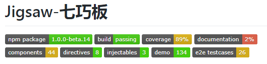

# 如何创建你自己的徽章，并用到github上
经常光顾github的工程的人，对工程readme上这些小玩意肯定不陌生：



这是Jigsaw七巧板<https://github.com/rdkmaster/jigsaw> 正在使用的徽章抓图，图中每一个小块大家称之为一个徽章。这些徽章的作用各不相同，但是大多是一些统计信息、状态信息。也有一些搞怪、表明态度的徽章。多种多样，彰显着工程维护者们的个性。

那么，这些徽章是怎么来的？如何获得徽章？如何获得自己专属的徽章？我们今天就来解决这个问题。

## 徽章到底是什么？
徽章可以说的github生态圈里的小精灵，小巧而可爱，它实际上是一个实时生成svg图片。

## 徽章是怎么来的？
Github的生态圈现在已经非常发达，这些徽章多数是由生态圈里的贡献者提供的。比如前文图中，Jigsaw七巧板使用的徽章中，第一个是由npmjs.org提供的，第二个是由TravisCI提供的，第三个是由coverall.io提供的。这些徽章提供的信息非常明了，一眼就可以看出它的用处。这也就是我们使用徽章的目的了。

还想知道github生态圈中还有谁能够提供徽章？https://shields.io 这个网站不会让你失望的。这网站专门收集能够提供徽章服务，的确非常多。但是如何想把自己特有一些信息以徽章的形式展示出来，靠这个网站是不够的。

## 如何获得自己的徽章？
这一小节我们来解决如何自定义徽章。比如我们打算把Jigsaw七巧板的文档覆盖率、测试用例数、已有组件数、已有demo数等以徽章的形式展示出来，应该如何做到？

### 静态图片
前文提到徽章都是实时生成的svg图片，可能有人会问，为啥不用静态图片？把自己想展示的信息放到静态图片，然后把图片放到readme里不就行了？信息有更新的话，直接替换服务器上的图片就好。

这个想法很好，笔者第一反应也是这么做，但是当和github的readme集成的时候，发现了问题：**由于浏览器的缓存，这些服务器更新了图片后，在github生成的readme上却不更新，这一点直接把这个方式给枪毙了**。

### 生成图片
不是因为静态图片不能显示，而是不能实时更新图片承载的信息，这是由于浏览器缓存导致的，这就好办了。我们只要写一个rest服务来返回一个svg，并给http应答设置一些头信息，让浏览器不要缓存它就好了。

在rest服务的应答消息头中，加入如下的条目

```
res.put('Pragma', 'no-cache');
res.put('Expires', new Date().toString());
res.put('Last-Modified', new Date().toString());
res.put('Content-Type', 'image/svg+xml');
```

我们设置了浏览器不缓存，并且把失效时间改为当前时刻，浏览器在下一次尝试请求这个图片的时候，就会发现这图片已经失效，于是它就会乖乖的再到服务器上去要一个最新的，我们的目的就达成了。最后一个条目是在设置内容类型，我们要告诉浏览器，这是一个svg图片，让浏览器以图片的形式来渲染它。

### 整体流程
这一小节我们来把整个流程做一下梳理。

1. 我们写脚本把生成svg图片所需的数据在代码库有更新的时候全部采集出来，并以label作为关键字持久化下来，Jigsaw七巧板是使用json格式报错这些数据的；
2. 我们使用RDK写一个rest服务（也可以用nodejs+express来写），它接收一个type参数作为第1步的label，作为检索关键字；
3. rest服务根据type参数读取到对应的数据信息，并将这些信息喂给svg模板，这样就可以得到一个svg图了；
4. 按照前文描述的，将强制浏览器不缓存的消息头写入应答，返回svg给请求方。

## 结论
通过前文的介绍，我们通过非常简单的方式就可以获得自己的专属徽章，大家快快去做自己的徽章吧。

## 题外话
这些文章是Jigsaw七巧板团队开发过程中碰到的难题的解决方法，或者成员的学习成果。我相信这些文章对喜欢Angular，喜欢Jigsaw的人，都同样值得一读。欢迎以任何形式转发，但是请保留Jigsaw七巧板的签名和链接 <https://github.com/rdkmaster/jigsaw> 点击阅读原文可以帮助我们改进这篇文章。