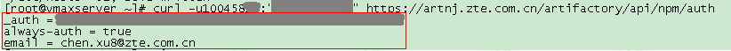

# 使用中兴内网的npm镜像

使用内部镜像可以非常显著的提升安装依赖包的速度，隆重推荐。

## 配置npm源

执行这个命令

```
npm config set registry https://artnj.zte.com.cn/artifactory/api/npm/public-npm-remote/
```

此外还有其他几个镜像可用，常驻西安的同学请将`artnj`改为`artxa`，常驻深圳的同学请将`artnj`改为`artsz`，常驻其他位置的，请酌情选用离你最近的镜像以求达到最快的速度。这个步骤可选。

## 配置node-sass镜像

执行这个命令

```
npm config set sass_binary_site http://rdk.zte.com.cn/mirrors/node-sass
```

## 生成认证信息

1. 在任意目录下执行这个命令
```
curl -u100458xx:"your-password" https://artnj.zte.com.cn/artifactory/api/npm/auth
```

你可以在git-bash中运行`curl`命令，也可以在服务器跑一下生成你的认证信息。

命令的输出大概如下：



2. 将上图红框中的3行粘贴到这个文件里 ~/.npmrc，追加在最后面就好了，修改后看起来像这样的


Windows上对应的npm配置文件在 `c:\Users\your-name\.npmrc`

## 删除网络代理

镜像处于内网，因此不能使用代理服务器了，用下面命令删除网络代理配置：

```
npm config delete proxy
```


## 题外话
这些文章是Jigsaw七巧板团队开发过程中碰到的难题的解决方法，或者是团队成员的学习成果。我相信这些文章对喜欢Angular，喜欢Jigsaw的人，都同样值得一读。欢迎以任何形式转发，但是请保留Jigsaw七巧板的签名和链接 <https://github.com/rdkmaster/jigsaw> 点击阅读原文可以帮助我们改进这篇文章。
