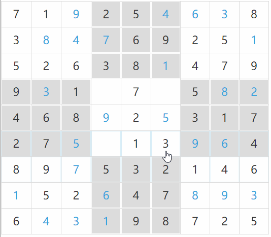
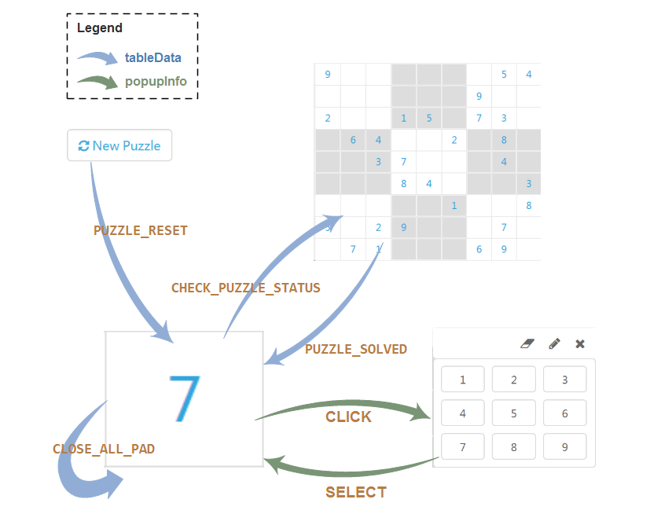
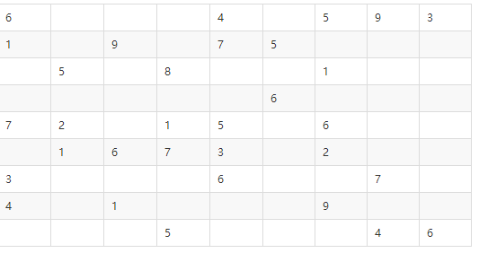
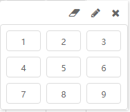
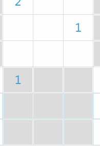
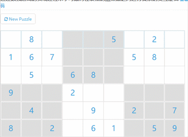

# 利用Jigsaw的表格来实现数独游戏

## 数独简介

很好玩的游戏，网上一大堆介绍，这里引用某度的一个[介绍](https://wenku.baidu.com/view/f9a4faf9c8d376eeaeaa3190.html)。

数独的游戏规则很简单，9x9个格子里，已有若干数字，其它宫位留白，玩家需要自己按照逻辑推敲出剩下的空格里是什么数字，使得每一行与每一列都有1到9的数字，每个小九宫格里也有1到9的数字，并且一个数字在每个行列及每个小九宫格里都只能出现一次。

## 运行效果

先看看最终的效果吧：



## 实现思路

基本思路非常简单，利用Jigsaw的表格来展示9x9宫格，然后做一个渲染器用于数字的填写，最后将这个渲染器应用到表格的每一个单元格中即可。

显然，最难的部分是填写数字的渲染器的实现。

整体事件流



## 页面基本元素

页面上核心部分是一个表格，代码及其简单：

```
<jigsaw-table [data]="tableData" [hideHeader]="true" width="528px">
</jigsaw-table>
```

我们不需要表头，因此将`hideHeader`设置为`false`，而且为了将宽度定死为528像素，这是为了让每个单元格看起来是一个正方形。在组件的ts代码中，需要定义一个`tableData`变量，并暂时先写好一个题目，代码看起来是这样的：

```
this.tableData = new TableData([
    ["6","","","","4","","5","9","3"],
    ["1","","9","","7","5","","",""],
    ["","5","","8","","","1","",""],
    ["","","","","","6","","",""],
    ["7","2","","1","5","","6","",""],
    ["","1","6","7","3","","2","",""],
    ["3","","","","6","","","7",""],
    ["4","","1","","","","9","",""],
    ["","","","5","","","","4","6"]
], '123456789'.split('').map(n => 'c' + n));
```

其中

```
'123456789'.split('').map(n => 'c' + n)
```

这行代码创建`TableData`的`field`属性值，`field`属性是表格渲染列的关键数据，不可或缺。

此时的效果为：



好像和预期差距很大，别急，这主要是我们的渲染器还没放上去的原因，这是正是接下来要做的事情。

## 实现数字渲染器

我们希望玩家单击数字之后，可以弹出一个面板让玩家挑选一个数字，而不是直接让玩家敲键盘。由此，引出了另一个需求：选择数字选择面板。

下面一步步来实现这个渲染器。

### 实现数字选择面板

这个面板的最终效果如下



结构很简单，上半部分是一排按钮，我们用font-awesome图标来实现，下半部分我挑选了j-tile组件来实现，像这样简单的一个组件的模板，分分钟就可以写出来了：

```
<div>
    <div class="toolbar">
        <span (click)="onClick('eraser')" class="fa fa-eraser"></span>
        <span (click)="onClick('pencil')" class="fa fa-pencil"></span>
        <span (click)="onClick('close')" class="fa fa-times"></span>
    </div>
    <j-tile width="185px" (selectedItemsChange)="onSelect($event)">
        <j-tile-option *ngFor="let num of numbers" [value]="num">
            {{num.label}}
        </j-tile-option>
    </j-tile>
</div>
```
下面实现这个面板的ts部分的代码，先看类的定义：

```
@Component({
    ...
})
export class NumberSelectPad implements IPopupable {
    answer = new EventEmitter<any>();
    initData: any;
    ...
}
```

注意：这个类实现了`IPopupable`接口，这是必须的，因为我们后面会通过`PopupService`将它弹出来，而`PopupService`只接受`IPopupable`类型的组件。`IPopupable`接口没有任何方法需要实现，只是定义了两个属性，分别是`answer`和`initData`。这两个属性在下面的交互过程中，起着非常重要的作用。这个`NumberSelectPad`组件与外部的交互，全部依赖这2个属性来完成，因此有必要介绍一下他们。

- `initData`：`PopupService`在将`NumberSelectPad`组件弹出来的时候，会实例化出`NumberSelectPad`组件的一个实例，并将应用给的一个任何对象传递给这个实例的`initData`属性中，作为当前`NumberSelectPad`组件实例的初始数据。这在下面的代码中会有进一步的说明。
- `answer`：这是一个`EventEmitter`类型的数据，它的作用是将组件内部的数据通过事件的方式传输到外界，这在下面的代码中我们将可以看到如何将当前选中的数字传输给数字渲染器组件的。

接下来就来看看如何将玩家选中的数字传给数字渲染器组件。

注意到`NumberSelectPad`组件的模板中`(selectedItemsChange)="onSelect($event)"`这个配置项，它告诉j-tile组件在选择有变化的时候，调用`onSelect()`方法：

```
onSelect(selected) {
    this.answer.emit({selected: selected[0].label});
}
```

我们直接通过`answer`将当前选中的数字，emit出去。这就是事件交互的好处，源头治理只管发送事件，而完全不需要关心是谁在关注这个事件，事件的关注着和监听者彻底解耦。

至此，数字选择面板就搞定了。

### 数字渲染器的视图

渲染器的视图超级简单，就一个大大的数字，水平和垂直居中：


这样的效果谁都可以做到，但是还是有必要将代码贴出来，因为下面的过程就是围绕这这小段代码来的

```
<div (click)="onClick($event)" [style.background]="bgColor" [style.color]="fontColor"
     (mouseenter)="onMouseEnter()" (mouseleave)="onMouseLeave()">
    {{cellData}}
</div>
```

css部分的代码就省略了。

几处关键配置项：
- `onClick()`：单击了数字之后，需要将`NumberSelectPad`组件弹出供玩家挑选一个数字；
- `bgColor`：我们通过背景色来提示玩家当前是否有错误以降低游戏难度；
- `fontColor`：题目已有的数字显示为蓝色，玩家挑选的数字显示为黑色，同样也是为了降低游戏难度；
- `onMouseEnter`/`onMouseLeave`没啥作用，只是增加鼠标滑过的效果；

下面来看看`onClick()`的逻辑

### `onClick()`的逻辑

按照我们之前预设的，渲染器单击了之后，是会弹出数字选择面板供玩家挑选一个数字，效果如下


现在就来完成这个功能，代码为

```
onClick(event: MouseEvent) {
    ...
    // 通知其他渲染器实例关掉已经打开的pad
    this.tableData.emit(CLOSE_ALL_PAD);
    const options = { ... };
    this.popupInfo = this.popupService.popup(NumberSelectPad, options, this.cellData);
    this.popupInfo.answer.subscribe(value => this.onSelect(value));
    ...
}
```

为了聚焦关注点，我隐去了部分代码，只留下了核心部分的逻辑，一个4行代码，实现了两个功能：

#### 功能1：关掉其他已经打开的数字选择面板

我们在第1行调用`tableData`对象发出了一个事件，从代码的字面上看，它是在通知监听者关闭数字选择面板。我们总是希望选择数字的面板同时只有一个被打开，因此这里通过事件的方式通知其他渲染器，如果有已经打开的面板，则关闭它。



请特别注意：**这个是渲染器之间进行交互的最主要方式：通过渲染器父类的`tableData`对象发送事件广播给其他所有同类渲染器**。这部分也是本文最核心的部分，请务必仔细阅读。

> 注意，每个渲染器都必须继承`TableCellRendererBase`类，这个类里实现了渲染器很多通用逻辑，包括定义了`tableData`属性。

那么渲染器如何处理这个`CLOSE_ALL_PAD`事件呢？

事件要被成功的处理，先决条件是要先监听它，在监听的时候，可以提供一个回调函数来处理这个事件。显然这里我们希望在渲染器一初始化完毕之后就监听这个事件，最标准的做法是通过Angular的生命周期钩子`OnInit`来实现。相关的代码在`ngOnInit()`中：

```
ngOnInit() {
    this.tableData.subscribe(event => {
        switch (event) {
            case CLOSE_ALL_PAD:
                this.closeNumberSelectPad();
                break;
            case ...:
                ...
        }
    });
}
```

注意回调函数里需要对事件的类型做判断，这是因为渲染器之间会有不止一个事件。

> 扩展1：如何在事件中携带数据？
> 
> 这是一个非常好的问题！
> 
> 我们在发出事件的时候给的啥数据（简单的/复杂的），回调函数收到的数据就是同一个对象。在本例中，我们发出事件时给的是一个字符串，那么回调函数里就收到该字符串。如果你需要传递复杂的数据结构，那么只要在发出事件的时候，给一个json对象就行了。
> 

> 扩展2：事件处理后，如何给发出事件方一些返回数据？
> 
> 一般来说，不会出现如此坑爹的交互过程，或者你的场景确实超级复杂。
> 
> 注意到我们在发出事件的时候给的对象和回调函数收到的对象是同一个，那在回调函数处理完毕之后，可以将数据直接定义到这个对象上。

> 扩展3：为啥不在渲染器的构造函数里监听这个事件？
> 
> 没错，这又是一个好的问题！
> 
> 这是因为`tableData`对象的初始化延迟造成的，Jigsaw需要先实例化渲染器，之后才能初始化`tableData`对象。构造函数在渲染器被实例化的一刹那就已经被调用，而此时在渲染器的构造函数里访问到的`tableData`对象必然是undefined的。这一点都不难理解。
> 
> 实际上，类似问题不仅在Jigsaw中会碰到，在普通的Angular程序中也会碰到，这也是为啥Angular团队会设计`OnInit`这样一个生命周期钩子的根本原因所在把。

#### 功能2：弹出数字选择面板

`onClick()`的逻辑里第2个功能是弹出数字选择面吧，代码摘抄如下

```
onClick(event: MouseEvent) {
    ...
    const options = { ... };
    this.popupInfo = this.popupService.popup(NumberSelectPad, options, this.cellData);
    this.popupInfo.answer.subscribe(value => this.onSelect(value));
    ...
}
```

关键逻辑在第2行上，我们调用`popupService`的`popup()`方法，并将`NumberSelectPad`类当做一个参数传给了这个方法，剩下的事件就全部交给Jigsaw了，很方便不是吗？

第3行代码看起来我们注册了另一个事件的回调，这是哪来的事件呢？还记得数字选择面板的`onSelect()`方法吗？就是在那里发出的，数字选择面板在玩家挑选好了一个数字之后，会发出这个事件，经过层层传播，最终在这个地方被我们抓住了，回调函数的逻辑也很简单

```
onSelect(value) {
    ...
    this.tableData.data[this.row][this.column] = value.selected;
    this.tableData.refresh();
    this.tableData.emit(CHECK_PUZZLE_STATUS);
    ...
}
```

关键部分就这3行，我们先更新了表格`tableData`的值，然后发出`CHECK_PUZZLE_STATUS`事件，告知监听者检查题目的状态，玩家的每一个选择都可能导致谜题被解开，我们需要就此做检查。

注意到第2行的`tableData.refresh()`，这是干啥用的呢？这是在通知表格，数据发生变化，需要更新一下视图啦。

> 扩展：`tableData.refresh()`这个方式，是Jigsaw向性能妥协后的产物。
>
> 我们都知道，Angular里没有了脏检查了，性能提升了没错，但是Angular开发团队却把问题留给了我们，组件内部只能感知到对象引用的变化，而无法感知到对象内部结构的变化。第1行代码，我们直接修改了`tableData`的内部结构，这样的行为angular是难以感知到的，他们也就无法采用最低廉的方式给Jigsaw发出通知，Jigsaw在这个情况下也就无法及时更新视图了。
> 
> 那为啥说这是向性能妥协的产物呢？前面我说了，angular是难以感知到对象的内部结构的变化，但是这不意味着angular做不到，实际上是能够做到的，通过`DoCheck`这个钩子，可以检测到任何变化，在这个钩子里，通过一些复杂的代码，是可以精确的筛选出这个变化的。但是这个事情的性能代价是非常昂贵，在IE11这个搓货上，体验会很差。经过相当长的纠结之后，我们决定放弃自动检测，和Angular团队一样，把问题丢给应用，让应用手工通知Jigsaw更新视图。

> 扩展：为啥`DoCheck`能够检测到任何变化？
>
> 为了解释清楚这个事情，先要理解zone.js，感兴趣的同学自行Google。

> 扩展：Angular官方推荐什么方式处理这个“缺陷”？
>
> 官方有两个方式：immutable对象或者Observable对象，感兴趣的同学自行Google。
>
> 题外话：我们深入了解了这个方式之后，认为这2个方法的优缺点都太明显，顾此失彼，都不好。于是发明了第三种方法，就是当前这个手工refresh的方式，可以认为这个方式是Observable的改良版，和Observable方式在核心理念上是统一的。

**及时清理回调函数钩子**，请养成这个好习惯，它可以让你的代码不会一点点变慢。

为了行文方便，我前面特意隐藏了`onClick()`的一些逻辑，主要就是清理回调函数钩子部分。这部分逻辑如下

```
onClick(event: MouseEvent) {
    if (this.popupInfo) {
        this.popupInfo.answer.unsubscribe();
        this.popupInfo.dispose();
    }
    this.popupInfo = this.popupService.popup(...);
    this.popupInfo.answer.subscribe(value => this.onSelect(value));
}
```

以及`onSelect()`里的

```
onSelect(value) {
    // 玩家选择了一个数字了，选择面板随即被关掉，
    // 那么之前设置的回调函数钩子都应该及时清理掉
    if (this.popupInfo) {
        this.popupInfo.answer.unsubscribe();
        this.popupInfo.dispose();
    }
    ...
}
```

好了，到这里，数独游戏的核心功能就基本开发完毕了，可以玩一玩了


### 收尾工作

包括：
- 检查谜题是否已被解开，这部分逻辑虽然有些绕，但是靠着编码基本功就能够实现的，就不专门讲解了；
- 装载新的谜题，以及81宫格的状态重置；
- 在数字选择面板中选择了擦除一个数组的功能的实现，这部分也涉及到事件交互，但是所用的知识不会超过前文所涉及的，也不展开讲解；
- bugfix，我自己玩了两局，发现还是有一些体验性小bug的待修复。

### 还可以做的更好

作为一个教学的demo来说，这个demo完成到这个程度就足够了，但是对于数独这个游戏来说，还有不少的事情要做，例如为了降低游戏难度，我们还应该实现铅笔功能。



此外，还可以增加更多的动画效果，以提升游戏过程中的乐趣。当然，还有bug要改了。

总之，这个事情还没结束，如果有激情有兴致继续完善这个游戏的，欢迎给我们PR，或者拉出去单干，我们会很乐意将你的游戏作品挂到我们的官网上供我们的开发者玩耍。