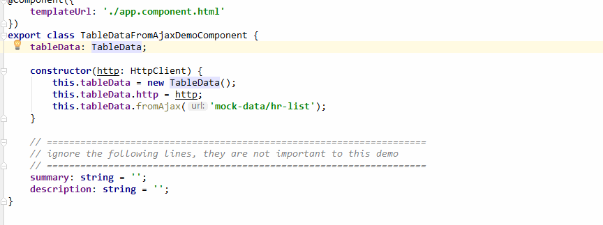

# Jigsaw设计理念之组合模式

## Jigsaw组合模式简介

Jigsaw将组件组合能力，从弱到强，分为3个Level，概要介绍如下：

- **组合层级 Level 1**

这个层次下的组合，组件本身被定义成一个原子，无法再拆分，既有的功能也无法再定制，只能某种特定场景的使用，一旦场景稍微有变化，则组件就很难胜任。处于这个Level的组件基本上可以判定为抽象程度不够，或者实现质量不佳，应该慎用。

- **组合层级 Level 2**

这个层次的组合主要体现在组件内部进行了二次抽象，将动态部分与组件的主体功能剥离并暴露出接口允许使用者根据自身的需要定制这部分动态的功能。每个组件，无论是多简单的，还是多复杂的，都是存在定制需求的。例如简单到类似按钮这样的组件，也可以有动态定制能力：按钮的说明除了是文字，应该还可以带有图标，甚至还需要能够放进去一个loading组件，或者下拉菜单组件。

这个层次的组合还体现在通用的无视图功能与组件之间的组合上，最典型的通用无视图功能为视图的弹出功能，这个功能自身没有任何视图，它的作用是把一个给定的视图（组件/模板）弹出在应用给定的位置上。

Jigsaw大大小小几乎所有的组件都处在这Level，最为典型的代表组件是`jigsaw-combo-select`组件和`PopupService`。

- **组合层级 Level 3**

这个层次的组合主要体现在组件与数据之间的组合上，不同的场景下，组件对输入给它的数据的处理逻辑是不一样的，因此有必要给不同的场景实现不同的组件数据处理逻辑。应用根据其实际场景挑选合适的数据处理逻辑与组件组合，从而降低应用对输入给组件的数据的加工工作。这个层次的组合是建立在组件实现了彻底的数据驱动的基础之上的，如果组件的视图与数据之间耦合过紧，没有彻底分离，是很难达到这个层次的组合的。

得益于数据处理逻辑上的抽象，应用在预置的数据逻辑无法满足其特定场景的时候，他可以挑选一个最接近的场景数据逻辑，然后扩展它，或者覆盖其默认行为，这样达到了定制场景数据的目的。

Jigsaw的多数复杂组件，都有类似的能力，包括表格、图形、树。

## 组合模式实战

### `jigsaw-combo-select`组件

这个组件是Jigsaw组合模式的典型代表之一，直接上代码

```
<jigsaw-combo-select placeholder="请输入姓名~" autoWidth="true"
    [(value)]="selectedCity" [clearable]="true" maxWidth="500">
    <ng-template>
        <jigsaw-tile [(selectedItems)]="selectedCity" trackItemBy="label">
            <jigsaw-tile-option *ngFor="let city of cities" [value]="city" width="21.4%">
                {{city.label}}
            </jigsaw-tile-option>
        </jigsaw-tile>
    </ng-template>
</jigsaw-combo-select>
```

对于`jigsaw-combo-select`组件，其动态部分就是下拉部分的视图，从上述代码可以看到，`jigsaw-combo-select`组件将这部分实现为完全由应用定义，应用使用`ng-template`定义下拉视图，理论上，应用可以将任意复杂的视图定义在下拉部分。而`jigsaw-combo-select`组件所做的事情，就是在适当的时候打开视图或者关闭视图，并在下拉视图改动了数据（本demo是`selectedCity`变量）之后，及时更新自身的视图。

因此，**你可以利用`jigsaw-combo-select`组件应对所有下拉的场景**。

运行效果如下：


此外，`jigsaw-combo-select`组件还额外定义了几个事件用于增强自身与下拉视图之间的交互性，让combo自身与下拉视图融为一体，这超出了本文讨论的范围，不展开。请自行阅读[相关demo](http://rdk.zte.com.cn/components/combo-select/demo#change-trigger)。

最后附上上述代码的 [demo](http://rdk.zte.com.cn/components/combo-select/demo#auto-width) 地址。


### `PopupService`服务

这是Jigsaw组合模式的另一个典型代表，直接上代码

```
this.popupService.popup(UserDialogComponent, this.getModalOptions(), initData);
```

第一个参数是一个组件的构造函数，或者是一个`TemplateRef<any>`类型，第二个参数用于控制弹出视图的位置、是否模态等信息。

通过`PopupService`服务你可以将任意视图弹出，因此，**你可以利用`PopupService`服务应对所有弹出的场景**。

最后附上上述代码的 [demo](http://rdk.zte.com.cn/components/dialog/demo#misc) 地址。

### 各种渲染器

渲染器被广泛应用到了Jigsaw的表格控件上，渲染器是组合模式的一种应用，它专注于修改视图的局部，给局部视图带来新的展示形式或者增加额外的交互动作。

先上图


对应的 [demo](http://rdk.zte.com.cn/components/table/demo#renderer) 地址。

从图上可以看到，表格有一些列出现一些变化，包括：
- 改变了外观，变成了一个checkbox；
- 增加了交互，“加薪”、“辞退”；

注意到列头也有一些变化：
- 有一个checkbox；
- 增加了下拉能力；

其实还有些变化从图片上看不出来，但是这些林林总总的变化，都是渲染器带来的。你可以将一个任意组件与表格组合，从而让表格里的数据变的更加生动和增加更多的交互。

再上两个图：


对应的 [demo](http://rdk.zte.com.cn/components/table/demo#calendar) 地址。

如果说上面这个日历还能看到表格的一点点影子，那么下面这个泳道图，你可能很难相信这也是一个表格吧：


对应的 [demo](http://rdk.zte.com.cn/components/table/demo#swim-lane-diagram) 地址。

Jigsaw的表格功能极其强大，后续会专门针对表格出讲座。

### 组件与数据的组合

这是一个大话题，需要专门出一个讲座。

### 其他

Jigsaw已有的所有demo中，能够体现出组合的，大概有这些：

- `jigsaw-button` + `jigsaw-loading`，对应的 [demo](http://rdk.zte.com.cn/components/button/demo#with-loading) 地址；
- `jigsaw-list` + `jigsaw-checkbox`，对应的 [demo](http://rdk.zte.com.cn/components/list/demo) 地址；
- `jigsaw-fish-bone` + 图/表格，对应的 [demo](http://rdk.zte.com.cn/components/fish-bone/demo) 地址；
- `jigsaw-radio`，对应的 [demo](http://rdk.zte.com.cn/components/radio-group/demo) 地址；


## 组合模式的短板

一个硬币总有两个面，这个小节我们来聊聊组合模式的短板。

目前已知的短板，主要体现在：

### 想象力

组合能够带来无穷的变化和可能，这没错，但是这是理论上的，将这些变化变现才能为我所用，你需要有一定的想象力才能发挥组合模式的作用。这个挑战更多的是Ux的同学来面对的，打破思维定式，尽可能多的采用组合，这样设计出来的页面才能既美观，又实用。

### 上手难度

如果说想象力这个挑战是Ux的同学来面对，那么上手Jigsaw这个问题则是留给开发的同学的。一般来说，组件集的抽象程度越高，它能覆盖的场景就越多，随之而来的它的上手难度也会越高。

Jigsaw核心团队一直以来都非常重视这方面的取舍，我们的取舍的原则是：追求在能够覆盖80%的场景的前提下，尽可能的简化和统一api。

此外，我们还通过如下的举措降低上手难度：

- **渐进式的组合**：这是一个关键的举措。有一些对Jigsaw不深，使用Jigsaw开发了一些**普通页面**的同学，可能反而觉得Jigsaw很好上手，这个现象的主要原因就在于Jigsaw渐进式的组合方式上了。Jigsaw所有组件的可组合的部分，全部都有其默认行为，因此你在无需了解一个组件的可组合部分是如何使用之前，就已经能够用这个组件开发普通页面了。同时，核心团队开发了大量的demo用于说明这些功能是如何使用，只要找到了对应的demo，拷贝粘贴demo上的代码，即使你不了解组合的原理，也能愉快的玩起来了。

- **强大的 live demo**：我们始终认为，demo是最好的学习途径，它比详实的API文档来的更加能够解决实际问题。因此我们不仅编写了大量的demo，而且将他们全部搬到线上（感谢[plunker](http://www.plnkr.co)），这是一个专门给懒人准备的demo学习环境，你不仅可以看到代码，还可以直接编辑他们，并且立即生效。你无需部署本地的开发环境就可以编辑并重新运行这些demo——真实懒人必备！你甚至可以利用线上的demo环境做为你的调试环境：把代码调试好了后，直接拷贝到你的生产环境中。我个人超喜欢这个方式，我早期学习angular的时候，几乎全部利用[angular.io](angular.io)上的live demo来完成的，边看文档，边在线验证。

Jigsaw线上的live demo的代码是自动生成出来的，并且我们的CI每天会检查新合入的修改是否会导致这些demo无法运行，从而确保这些live demo的可靠性。

- **详实的API文档**：虽然我们认为API文档的作用没有demo高，但是我们依然仔细给每个组件的各个输入输出属性编写API文档。这些文档的线上地址是<http://rdk.zte.com.cn/components/jigsaw/api-list>，不过，我们并不推荐你在线上阅读他们，而是推荐你直接在你的IDE上直接跳转到声明的方式来阅读这些文档。因为有需要翻阅API的需求，往往是在你编码的时候，这个时候，直接在IDE上跳转到Jigsaw的组件声明上阅读文档，对你的思路的打断最小，而且你可以非常方便的回到上一次编辑点继续你的编码过程。我们推荐使用[VS Code](http://vscode.visualstudio.com/)或者是[WebStorm](https://www.jetbrains.com/webstorm)来开发Jigsaw应用。



- **组件的二次封装**：这个事情仍处于计划阶段。我们在计划发起一个JigsawX库，作为Jigsaw组件集的扩展，在这个库里收集贴近业务场景的二次封装组件。如前面说的，组件集的抽象程度越高，随之而来的它的上手难度也会越高，反过来也成立，组件集的抽象程度越低，使用难度也就越低，代价是能够覆盖的场景越少。和Jigsaw核心库不一样，JigsawX库将几乎不设置准入门槛，任何你认为有用的组件，只要带上demo、demo说明、必要的API文档、自动化测试用例，就可以被收录到这个库里，共享给其他小伙伴。大数据产品线一直在鼓励共创，如果你推送的组件确实质量过硬数量够多，则可以申请大数据产品线的共创现金激励。

- **各种技术文章和讲座**：我们的技术文档一般都会发布在Jigsaw团队的官方微信公众号上，扫一扫下面二维码可以关注它：


也欢迎你投稿，分享你使用Jigsaw过程中碰到的喜悦和苦恼。