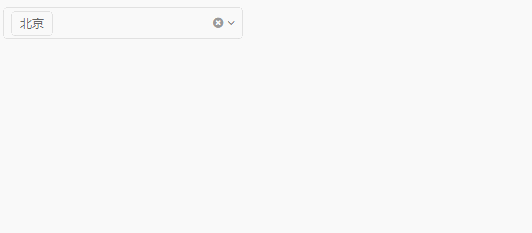

# Jigsaw的设计理念

用户可以不需要了解jigsaw的内部实现，但理解了jigsaw的设计理念，在开发页面时会更游刃有余。

## 定制化

组件支持可定制，可以满足不同页面的定制化需求。比如一个dialog分为header、content和footer，我们分别给这三个部分实现了定制功能：

```
<jigsaw-dialog width="800px" (close)="onAnswer()">
    <!-- header -->
    <div jigsaw-title>
        <span class="fa fa-thumbs-up"></span>Title of the dialog
    </div>
    <!-- content -->
    <div jigsaw-body>
        <ul class="dialog-content">
            <li>Dialog content...</li>
            <li>Dialog content...</li>
            <li>Dialog content...</li>
        </ul>
     </div>
    <!-- footer -->
    <div jigsaw-button-bar>
        <jigsaw-button colorType="primary" (click)="onAnswer('OK')">OK</jigsaw-button>
        <jigsaw-button (click)="onAnswer('Cancel')">Cancel</jigsaw-button>
    </div>
</jigsaw-dialog>
```

转变成视图([demo地址](http://rdk.zte.com.cn/components/combo-select/demo#auto-width))：


类似的[collpase](http://rdk.zte.com.cn/components/collapse/demo)、[tab](http://rdk.zte.com.cn/components/tab/demo)都是通过这种方式配置内容的

## 组合

组合是指两个或更多组件之间数据共通，连贯交互，以实现某个特定的功能。比如下面这个多选框，其实就是combo组件和tile组件组合起来实现的功能。combo可以实现下拉tile，同时两个组件的数据是共通的。



实现起来很简单，[demo地址](http://rdk.zte.com.cn/components/combo-select/demo#auto-width)

```
<jigsaw-combo-select
    placeholder="请输入姓名~"
    autoWidth="true"
    [(value)]="selectedCity"
    [clearable]="true"
    maxWidth="500">
    <ng-template>
        <jigsaw-tile
            [(selectedItems)]="selectedCity"
            trackItemBy="label">
            <jigsaw-tile-option *ngFor="let city of cities" [value]="city" width="21.4%">
                {{city.label}}
            </jigsaw-tile-option>
        </jigsaw-tile>
    </ng-template>
</jigsaw-combo-select>
```

可以从视图代码里看到，tile像一个模块一样放到combo内部，并且他们之间有一些‘连接线’(`selectedCity`)，这就好比组装一个遥控汽车，把电池，马达用线路连接起来差不多。

Jigsaw有很多组合的例子，比如把table和pagination组合起来就能实现分页([demo地址](http://rdk.zte.com.cn/components/table/demo#local-paging-data))，把combo和time组合起来就能实现时间选择器（[demo地址](http://rdk.zte.com.cn/components/time/demo#with-combo-select)）。

同样的，我们某些组件内部也是通过组合的方式实现的，比如上面的[tile](http://rdk.zte.com.cn/components/tile/demo#full)，你可以看到他是由jigsaw-tile和一组jigsaw-tile-option组成的，我们如此设计也主要考虑到option选项的可定制性。类似的还有[radio](http://rdk.zte.com.cn/components/radio-group/demo#full)、[list](http://rdk.zte.com.cn/components/list/demo#full)。

## 渲染器

我们在组件里面放入了很多的渲染器容器，只要塞入指定的渲染器，就能在容器中渲染出来。

比如table的列渲染器


我们的渲染器有两种形式：组件和模板

#### 组件渲染器

```
@Component({
template: '<span class="fa fa-bicycle"></span><span>{{context.cellData}}</span>'
})
export class BicycleCellRenderer extends TableCellRendererBase {
}
```

[demo地址](http://rdk.zte.com.cn/components/table/demo#renderer)

#### 模板渲染器

```
<ng-template #cellName let-context="context">
<span class="fa fa-bicycle"></span><span>{{context.cellData}}</span>
</ng-template>
```

[demo地址](http://rdk.zte.com.cn/components/table/demo#template-ref-renderer)

#### 内部渲染器

table内部还自带了几个重要的渲染器：

 - [checkbox渲染器](http://rdk.zte.com.cn/components/table/demo#checkbox-column)
 - [编辑单元格渲染器](http://rdk.zte.com.cn/components/table/demo#cell-editable)

## 全局的popup服务

前面说的dialog自身是不具备弹出的功能的，我们通过注册在全局的PopupService来进行弹出。

step1：在根模块导入`JigsawRootModule`模块

step2：在根组件视图里加入

```
<j-root>
    <!-- 所以其他内容写这里 -->
</j-root>
```

step3：在需要弹框的组件里面注入`PopupService`

```
constructor(private popupService: PopupService) {
}
```

step4：调用popup方法

```
this.dialogInfo = this.popupService.popup(ele);
```

step5：销毁弹框

```
this.dialogInfo.dispose();
```

PopupService支持弹出组件和模板，可以看下[demo](http://rdk.zte.com.cn/components/dialog/demo#misc)；

PopupService还有一些弹出配置，可以看下[demo](http://rdk.zte.com.cn/components/dialog/demo#popup-option)；

PopupService弹出[alert]()，[tooltips](http://rdk.zte.com.cn/components/tooltip/demo#dialog)；

通过PopupService衍生出了[LoadingService](http://rdk.zte.com.cn/components/loading/demo)，其内部也是通过PopupService弹出的。

> 前面说的combo-select的下拉弹框也是PopupService提供的

## 数据模型

### 变化检测

还记得最前面说的combo和tile组合的时候有一个‘连接线’(`selectedCity`)，为什么通过这个‘连接线’，就能让combo和tile的视图自动发生变化呢？主要这边的‘连接线’是我们自己封装的数据模型`ArrayCollection`，里面可以注册一个叫`onRefresh`的回调钩子，也可以通过`refresh`方法触发这个回调。在`ArrayCollection`中，当数据发生变化时，`ArrayCollection`会自动触发`refresh`调用钩子。就是这样的钩子，使得combo和tile，在每次`selectedCity`发生变化时，能及时更新视图。

我们基于这样的机制，封装了

 - [TableData](http://rdk.zte.com.cn/components/table/demo#data-from-ajax)
 - [PageableTableData](http://rdk.zte.com.cn/components/table/demo#pageable)
 - [LocalPageableTableData](http://rdk.zte.com.cn/components/table/demo#local-paging-data)
 - [BigTableData](http://rdk.zte.com.cn/components/table/demo#big-table)
 - [PieGraphData](http://rdk.zte.com.cn/components/graph/demo#pie)
 - [LineBarGraphData](http://rdk.zte.com.cn/components/graph/demo#line-bar-graph-ajax)
 - [TreeData/SimpleTreeData](http://rdk.zte.com.cn/components/tree/demo#data-from-ajax)

这是我们的数据关系图


 > Jigsaw在组件数据的封装这方面，也是下足了功夫的。

 > 图上可以看到组件数据的继承关系网，这么复杂的关系网就足以知道我们在这方面的抽象程度有多高。

 > 虽然关系网非常复杂，但是，应用仅需要知道关系网的最端点上的数据就可以溜溜的用起来了。

数据模型[详情](http://rdk.zte.com.cn/components/api/interface/IComponentData)

### 数据源

我们的数据模型支持一些获取数据源的API

 - fromAjax 通过url发送ajax请求
 - onAjaxStart 
 - onAjaxSuccess
 - onAjaxComplete 在ajax执行完成，数据会自动执行`异步`的`refresh`，调用所有的`onRefresh`钩子
 - onAjaxError
 - dataReviser 定义一个处理data的函数，返回data，见[demo](http://rdk.zte.com.cn/components/table/demo#checkbox-column-object-cell)，这个预处理是在ajax返回了数据时，onAjaxSuccess之前执行的


