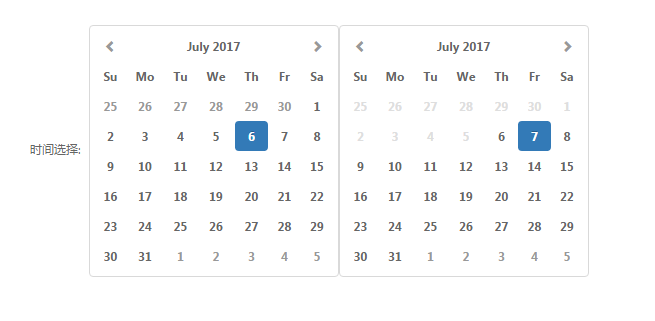
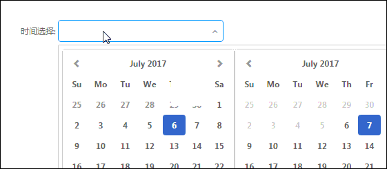

# 时间选择器

众多大数据应用中选择条件永远离不开时间，我们就以时间选择器的使用来打开Jigsaw的大门。

_**app.component.html**_ 中添加 html 片段

```
 <span>时间选择:</span> 
 <jigsaw-range-time [(beginDate)]="beginDate" [(endDate)]="endDate"></jigsaw-range-time>
```

_**app.component.ts**_ 中添加代码片段

```
 beginDate = 'now-1d';
 endDate = 'now';
```

浏览器显示如下图



到目前为止，时间选择器已经显示出来了，但是一般而言，我们做应用时直接将时间这样显示的很少，一般都是配合input框，点击之后下拉出可供选择的时间。Jigsaw中的 _**jigsaw-combo-select**_ 组件正适合做这件事。

_**app.component.html**_ 中修改 html 片段为

```
<jigsaw-combo-select  openTrigger="click">
    <ng-template>
        <jigsaw-range-time [(beginDate)]="beginDate" [(endDate)]="endDate">
        </jigsaw-range-time>
    </ng-template>
</jigsaw-combo-select>
```

浏览器显示如下



OK，是不是使用 起来挺容易的，其实这么小小的一小步你就已经开始使用了Jigsaw的一大两点 _**组合**_ 的功能了，当然目前整个时间显示还不太完美，我们需要给comboSelect初始值来显示当前的时间，需要给time添加change事件来监控时间选择的变化并且同步到comboSelect上面去。完整代码如下

_**app.component.html**_

```
<span>时间选择:</span>
  <jigsaw-combo-select [(value)]="rangeTimeComboValue" openTrigger="click">
    <ng-template>
        <jigsaw-range-time [(beginDate)]="beginDate" [(endDate)]="endDate" 
       (change)="handleChange($event)">
        </jigsaw-range-time>
    </ng-template>
  </jigsaw-combo-select>
```

_**app.component.ts**_

```
import {Component, Renderer2, ViewContainerRef} from '@angular/core';
import {TimeGr, TimeService} from '@rdkmaster/jigsaw';

@Component({
  selector: 'app-root',
  templateUrl: './app.component.html',
  styleUrls: ['./app.component.css']
})
export class AppComponent {

  beginDate = 'now-1d';
  endDate = 'now';
  rangeTimeComboValue = [
    {label: TimeService.getFormatDate(this.beginDate, TimeGr.date), closable: false},
    {label: TimeService.getFormatDate(this.endDate, TimeGr.date), closable: false}
  ];

  handleChange() {
    this.rangeTimeComboValue = [
      {label: TimeService.getFormatDate(this.beginDate, TimeGr.date), closable: false},
      {label: TimeService.getFormatDate(this.endDate, TimeGr.date), closable: false}
    ];
  }
}
```

[在线例子](javascript:alert('建设中')) / [下载代码](https://github.com/rdkmaster/jigsaw-tourist/archive/step-1.zip)

---

[上一步](01-development-environment.md) | [下一步](03-tileselect.md)
