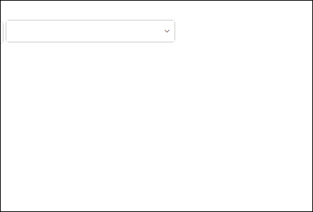

# 麻将牌选择器

我们日常所开发的应用中多选的情况比比皆是，Jigsaw中提供了tile-select的组件来满足类似的需求。

_**app.component.html  **_中添加 html 片段，并且同样直接加上comboSelect

```
<jigsaw-combo-select [(value)]="selectedPeriodTimes" openTrigger="click" [disabled]="!status">
    <ng-template>
        <jigsaw-tile-select
          [(selectedItems)]="selectedPeriodTimes"
          labelField="label"
          [data]="periodTimes"
          width="350px"
          tileOptionWidth="100px">
        </jigsaw-tile-select>
    </ng-template>
</jigsaw-combo-select>
```

_**app.component.ts**_ 中添加代码片段

```
 periodTimes = [{label: '1', closable: false}, {label: '2', closable: false}, {label: '3', closable: false},
    {label: '4', closable: false}, {label: '5', closable: false}, {label: '6', closable: false},
    {label: '7', closable: false}, {label: '8', closable: false}, {label: '9', closable: false},
    {label: '10', closable: false}, {label: '11', closable: false}, {label: '12', closable: false}];
```

浏览器效果如下



根据此应用的具体需求要求当多时段设置为true的时候，该条件才可以选择，让我们来加上和checkbox配合使用的代码

_**app.component.html  **_中修改如下

```
 <jigsaw-checkbox [enableIndeterminate]="false" [(checked)]="status">多时段设置</jigsaw-checkbox>
  <jigsaw-combo-select [(value)]="selectedPeriodTimes" openTrigger="click" [disabled]="!status">
    <ng-template>
        <jigsaw-tile-select
          [(selectedItems)]="selectedPeriodTimes"
          labelField="label"
          [data]="periodTimes"
          width="350px"
          tileOptionWidth="100px">
        </jigsaw-tile-select>
    </ng-template>
  </jigsaw-combo-select>
```

OK,至此我们已经将 checkbox,comboSelect,tileSelect三者结合使用，组合之美由此体现。

完整代码如下

_**app.component.html  **_

```
<div>
  <span>时间选择:</span>
  <jigsaw-combo-select [(value)]="rangeTimeComboValue" openTrigger="click">
    <ng-template>
        <jigsaw-range-time [(beginDate)]="beginDate" [(endDate)]="endDate" 
        (change)="handleChange($event)"></jigsaw-range-time>
    </ng-template>
  </jigsaw-combo-select>
  <jigsaw-checkbox [enableIndeterminate]="false" [(checked)]="status">多时段设置</jigsaw-checkbox>
  <jigsaw-combo-select [(value)]="selectedPeriodTimes" openTrigger="click" [disabled]="!status">
    <ng-template>
        <jigsaw-tile-select
          [(selectedItems)]="selectedPeriodTimes"
          labelField="label"
          [data]="periodTimes"
          width="350px"
          tileOptionWidth="100px">
        </jigsaw-tile-select>
    </ng-template>
  </jigsaw-combo-select>
</div>
```

_**app.component.ts**_

```
import {Component, Renderer2, ViewContainerRef} from '@angular/core';
import {ArrayCollection, TimeGr, TimeService} from '@rdkmaster/jigsaw';

@Component({
  selector: 'app-root',
  templateUrl: './app.component.html',
  styleUrls: ['./app.component.css']
})
export class AppComponent {

  beginDate = 'now-1d';
  endDate = 'now';
  rangeTimeComboValue = new ArrayCollection([
    {label: TimeService.getFormatDate(this.beginDate, TimeGr.date), closable: false},
    {label: TimeService.getFormatDate(this.endDate, TimeGr.date), closable: false}
  ]);
  periodTimes = [{label: '1', closable: false}, {label: '2', closable: false}, {label: '3', closable: false},
    {label: '4', closable: false}, {label: '5', closable: false}, {label: '6', closable: false},
    {label: '7', closable: false}, {label: '8', closable: false}, {label: '9', closable: false},
    {label: '10', closable: false}, {label: '11', closable: false}, {label: '12', closable: false}];

  constructor(public viewContainerRef: ViewContainerRef, public renderer: Renderer2) {
  }

  handleChange() {
    this.rangeTimeComboValue = new ArrayCollection([
      {label: TimeService.getFormatDate(this.beginDate, TimeGr.date), closable: false},
      {label: TimeService.getFormatDate(this.endDate, TimeGr.date), closable: false}
    ]);
  }
}
```

[在线例子](javascript:alert('建设中')) / [下载代码](https://github.com/rdkmaster/jigsaw-tourist/archive/step-2.zip)

---

[上一步](02-time.md) | [下一步](04-radio.md)
