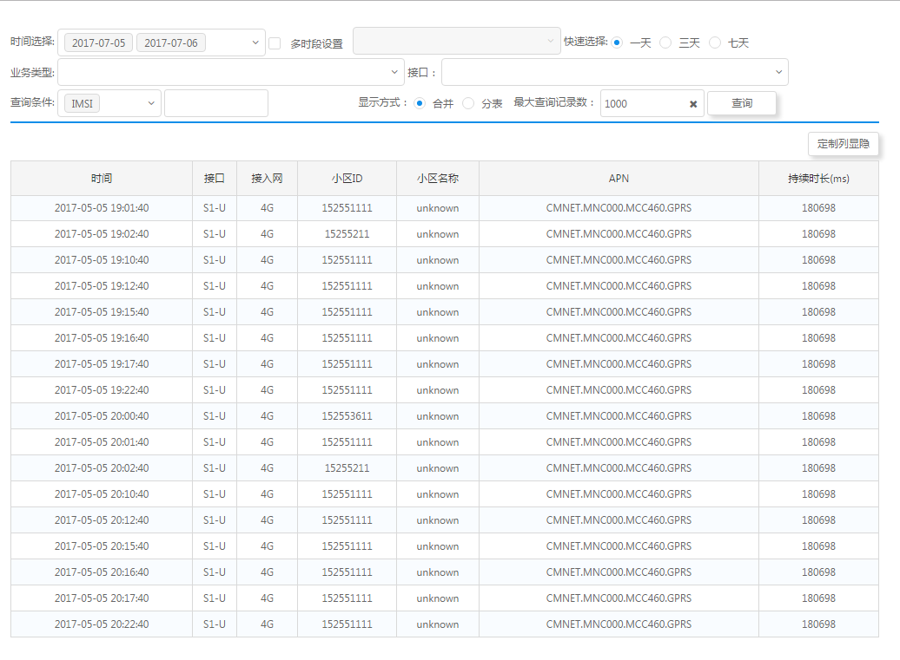

# Jigsaw-tourist

Jigsaw 是基于Angular\(4+\)实现的组件集，是中兴通讯大数据应用支撑组件 RDK 的下一代组件集。RDK被广泛应用在中兴大数据的各个产品，在国内外已有多个商用局。这套组件最主要的设计目标是用于构建复杂、交互密集型页面 。临时演示环境为 [http://rdk.zte.com.cn/component/](http://rdk.zte.com.cn/component/). 该项目目前在github上面开源 [https://github.com/rdkmaster/jigsaw](https://github.com/rdkmaster/jigsaw), 请不吝赏个星星支持下。

本文档将通过创建一个简单应用帮助你一步步了解如何使用Jigsaw。[我们开始吧！](01-development-environment.md)

应用页面总览截图如下：

注意：阅读本文档之前，最好先看一遍angular官方的英雄指南 [https://angular.cn/docs/ts/latest/tutorial/](https://angular.cn/docs/ts/latest/tutorial/)
